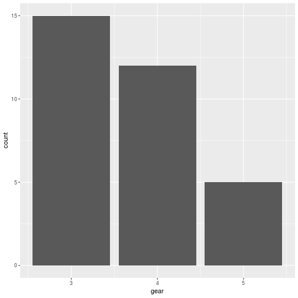

Nesse breve tutorial, vamos aprender a utilizar o R para enviar e-mails.


```r
#Essa função testa
if(!require(gmailr)) install.packages("gmailr")
```


```r
library(tidyverse)

mtcars %>% 
  ggplot(mapping = aes(x = gear)) + 
  geom_bar()
```




