# Treinando gráficos no R

Neste tutorial vamos treinar o uso do pacote _ggplot2_. Diferentemente dos demais tutoriais do curso, o objetivo deste é oferecer desafios, e não códigos. Você deve ver o gráfico e tentar reproduzí-lo. Recomendo que você use a versão deste tutorial em .pdf, que contém os gráficos, e tente criar os gráficos sem ajuda alguma. Ao final do tutorial estão "colados" os códigos de todos os gráficos, na sequência, para serem consultados em caso de dúvida.

Escolhi os gráficos que, ao meu ver, são mais úteis para exploração e visualização de distribuições de variáveis, sozinhas ou conjuntas, discretas ou contínuas. _ggplot2_ é um mundo vasto. Este tutorial contém apenas aquilo que considero o mínimo para produção de uma pesquisa.

A fonte online sobre _ggplot2_ que mais consulto é o website do livro [R Graphics Cookbook](http://www.cookbook-r.com/Graphs/). Há pequenos tutoriais sobre os tópicos essenciais da produção de gráficos com _ggplot2_ e você pode navegar por lá se sobrar tempo em sala de aula.

Vamos usar o data frame "fake\_data" para nosso treino:


```r
library(readr)
url_fake_data <- "https://raw.githubusercontent.com/leobarone/FLS6397/master/data/fake_data.csv"
fake <- read_delim(url_fake_data, delim = ";", col_names = T)
```

Carregue o pacote _ggplot2_ e comece:


```r
library(ggplot2)
```

## Gráficos para uma variável discreta

Vamos começar com gráficos de barras, adequados para uma única variável discreta. Contrua o gráfico abaixo, para a variável "party". O código esta propositalmente omitido e você deve "se virar" para construir o gráfico.

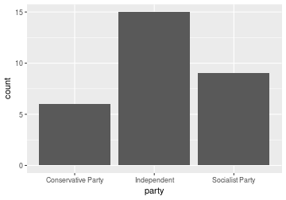

Se utilizarmos no argumento "fill" na "aesthetics" do ggplot uma outra variável discreta, obtemos. Teste você mesm@:


Vamos agora variar as posições das barras alterando os valores do argumento "position" em _geom\_bar_. Os valores para "position" são: "stack" (default, mostrado acima), "dodge" e "fill":

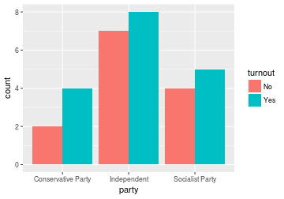

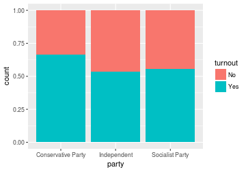

## Gráficos para uma variável contínua

Comecemos com a variável "income". Vamos construir um histograma. Por termos poucos dados, use "bins = 10" como argumento para construção do histograma:


Novamente, inclua "turnout" no argumento "fill" de "aesthetics" e observe o resultado


Tal como com os gráficos de barra, varie a posição do histograma. O argumento "position" pode receber os valores: "stack" (default, mostrado acima), "dodge" e "fill":


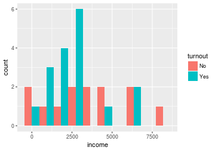


```
## Warning: Removed 4 rows containing missing values (geom_bar).
```

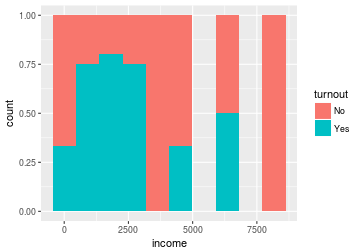


Gráficos de densidade costumam ser uma opção mais atrativa para variáveis verdadeiramente contínuas (e não númericas discretas, como idade em anos, por exemplo). Produza a densidade de "income":

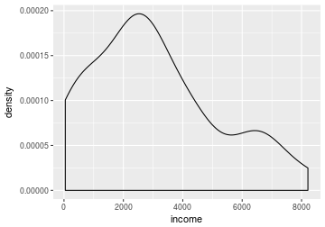

Vamos agora separar as densidades inserindo uma variável discreta no argumento "fill", tal como "turnout":


Veja que só conseguimos separar as densidades por estarmos trabalhando com uma única variável contínua separada por uma variável discreta. Se quisermos, porém, sobrepor as densidades de duas variáveis contínuas, temos que passar os argumentos "aesthetics" da função _ggplot_ para dentro de _geom\_density_. Tente reproduzir o gráfico abaixo usando "income" e "savings". Não se preocupe com os rótulos dos eixos por enquanto:


## Uma variável discreta e uma contínua

Uma das opções para apresentarmos conjuntamente uma variável discreta e uma contínua é utilizarmos o gráfico de barras com o argumento 'stat = "identity"' em _geom\_bar_. Note que a variável discreta é o argumento "x" e a contínua, "y". Tente você:

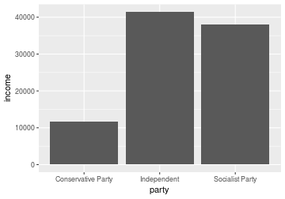

Box-plots também são opções excelentes:

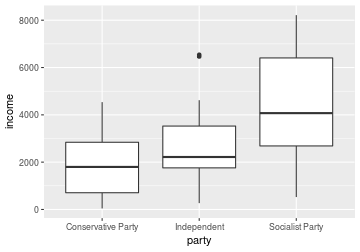


## Duas variáveis contínua:

Vamos agora trabalhar com a apresentação conjunta de duas variáveis contínuas, "income" (x) e "savings" (y). O gráfico de dispersão é obviamente a opção básica:


A reta que descreve uma função linear entre as duas variáveis é outra opção. Dica: use _geom\_smooth_ e adota o argumento 'method = "lm"', onde "lm" significa "linear model"


Combine os dois gráficos anteriores:

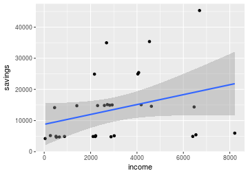

Se quiser retirar o intervalo de confiança do modelo linear, representado pela área cinza, use "se = FALSE":

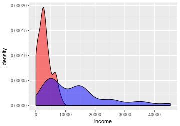

Há alternativas ao modelo linear. Use 'method = "loess"' para um ajuste polinomial:

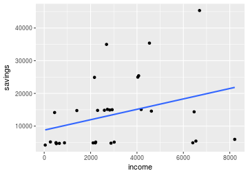

Voltando ao gráfico de dispersão básico, podemos separa os pontos por uma terceira variável (discreta). Use o argumento "color" em "aesthetics". Vamos separar por "turnout":

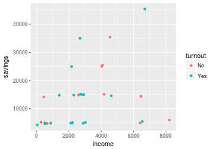

Podemos apresentar um modelo linear para cada grupo de "turnout":


Se no lugar de colocarmos "turnout" no argumento "color", colocarmos em "shape", teremos variação no formato dos pontos:

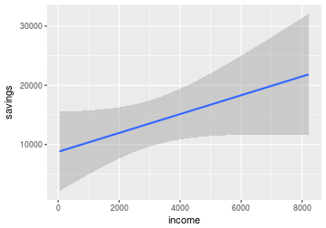

## Mais opções gráficas

Se quisermos separar os dados em diferentes paineis, digamos, por grupo candidato de preferência (variável "candidate"), usamos _facet\_wrap_ com a seguinte fórmula "(~ candidate)":


Podemos alterar as legendas de um gráfico usando as funções _xlab_ e _ylab_:

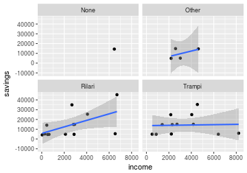

E podemos adicionar título com _ggtitle_:

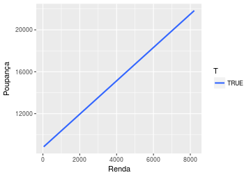

Há um conjunto de funções que alteram os "temas" dos gráficos. Por padrão, usamos _theme\_grey_. Os temas básicos são: _theme\_classic_, _theme\_bw_, _theme\_minimal_, _theme\_void_. Teste cada uma deles, como na sequência abaixo. Há um pacote chamado _ggthemes_ que contém diversos outros "temas":

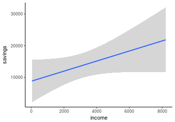


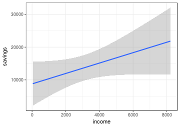

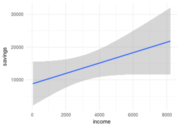

## Salvando os gáficos

Você pode usar tanto o botão "Export" no RStudio quanto a função `ggsave`. Veja o exemplo abaixo, que salva o gráfico disponível no ferramenta de visualização em diversos formatos, respectivamente .png, pdf e .jpeg, e com dimensões definidas pelos argumentos _width_ e _height_.


```r
ggsave("plot.png", width = 5, height = 5)
ggsave("plot.pdf", width = 5, height = 5)
ggsave("plot.jpeg", width = 5, height = 5)
```

### Respostas

Código dos gráficos acima, na sequência:


```r
ggplot(fake, aes(x = party)) +
geom_bar()

ggplot(fake, aes(x = party, fill = turnout)) +
geom_bar()

ggplot(fake, aes(x = party, fill = turnout)) +
geom_bar(position = "dodge")

ggplot(fake, aes(x = party, fill = turnout)) +
geom_bar(position = "fill")

ggplot(fake, aes(x = income)) +
geom_histogram(bins = 10)

ggplot(fake, aes(x = income, fill = turnout)) +
geom_histogram(bins = 10)

ggplot(fake, aes(x = income, fill = turnout)) +
geom_histogram(bins = 10, position = "dodge")

ggplot(fake, aes(x = income, fill = turnout)) +
geom_histogram(bins = 10, position = "fill")

ggplot(fake, aes(x = income, fill = turnout)) +
geom_histogram(bins = 10, position = "stack")

ggplot(fake, aes(x = income)) +
geom_density()

ggplot(fake, aes(x = income, fill = turnout)) +
geom_density(alpha = 0.5)

ggplot(fake) +
geom_density(aes(x = income), alpha = 0.5, fill = 'red') +
geom_density(aes(x = savings), alpha = 0.5, fill = 'blue')

ggplot(fake, aes(x = party, y = income)) +
geom_bar(stat = "identity")

ggplot(fake, aes(x = party, y = income)) +
geom_boxplot()

ggplot(fake, aes(x = income, y = savings)) +
geom_point()

ggplot(fake, aes(x = income, y = savings)) +
geom_smooth(method = "lm")

ggplot(fake, aes(x = income, y = savings)) +
geom_point() +
geom_smooth(method = "lm")

ggplot(fake, aes(x = income, y = savings)) +
geom_point() +
geom_smooth(method = "lm", se = F)

ggplot(fake, aes(x = income, y = savings)) +
geom_point() +
geom_smooth(method = "loess")

ggplot(fake, aes(x = income, y = savings, color = turnout)) +
geom_point()

ggplot(fake, aes(x = income, y = savings, color = turnout)) +
geom_point() +
geom_smooth(method = "lm", se = FALSE)

ggplot(fake, aes(x = income, y = savings, shape = turnout)) +
geom_point()

ggplot(fake, aes(x = income, y = savings)) +
geom_point() +
geom_smooth(method = "lm") +
facet_wrap(~ candidate)

ggplot(fake, aes(x = income, y = savings, fill = T)) +
geom_smooth(method = "lm", se = F) +
ylab("Poupança") +
xlab("Renda")

ggplot(fake, aes(x = income, y = savings)) +
geom_smooth(method = "lm") +
ggtitle("Poupança por renda em Fakeland")

ggplot(fake, aes(x = income, y = savings)) +
geom_smooth(method = "lm") +
theme_classic()

ggplot(fake, aes(x = income, y = savings)) +
geom_smooth(method = "lm") +
theme_bw()

ggplot(fake, aes(x = income, y = savings)) +
geom_smooth(method = "lm") +
theme_minimal()

ggplot(fake, aes(x = income, y = savings)) +
geom_smooth(method = "lm") +
theme_void()
```

