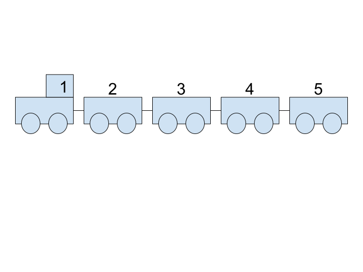

```{r setup, include=FALSE, echo = FALSE}
knitr::opts_chunk$set(echo = TRUE,
                      message = FALSE,
                      warning = FALSE,
                      fig.width = 6.0,
                      fig.height = 5.0)
```

## 1. Introdução

Os dados estão mais próximos de nós do que imaginamos! Podemos consumi-los de diversas formas e uma delas é para nos auxiliar na tomada de decisão ou entendimento sobre algum fenômeno do nosso cotidiano.

```{r, echo = FALSE}
knitr::include_graphics("imagem2.jpeg")
```

Uma das formas mais comuns de analisar esses dados é por meio da __programação__, instruções que o computador recebe para realizar certas tarefas. Estas "instruções" são também chamadas de __algoritmos__, uma sequência de passos lógicos até a realização de determinadas tarefas. Vamos pensar no algoritmo do miojo:

> Passo 1: Tire da embalagem\n Passo 2: Aqueça a água\n Passo 3: Coloque o miojo na água quente\n Passo 4: Adicione o tempero\n Passo 5: Sirva!

Simples, não?

Para que possamos enviar essas instruções para o computador nós precisamos utilizar linguagens que são capazes de ser interpretadas pela máquina e uma delas é o __R__. Mas por que o R?

- O custo de entrada é menor*

- É de graça

- Uma comunidade enorme

Você pode estar se perguntando (ou não) o seguinte: "Como assim o custo de entrada é menor? Não é uma linguagem de programação assim como as outras?". Então, sim, o __R__ é uma linguagem de programação assim como outras que estão por aí, porém, ao longo dos anos as pessoas desenvolveram muitos _pacotes_ voltados para uma análise de dados de forma mais intuitiva. Por exemplo, a fim de selecionar observações (linhas) de interesse, podemos utilizar uma _função_ chamada `filter`, que filtra (seleciona) apenas as linhas desejedas de acordo com as intruções fornecidas. Se isso pareceu confuso, calma! Logo nós iremos utilizá-la junto com outras _funções_ e tudo ficará mais claro.

### O R Básico

Ok, alguns conceitos apareceram, mas não precisamos ficar assustados vamos entende-los. Como queremos utilizar o __R__ para análise de dados, desde o começo iremos nos deparar com duas coisas muito importantes: funções e pacotes. Funções podem ser entendidas como __comandos__. Elas realizam alguma operação. Normalmente, para realizar essa tarefa, elas recebem um _input_ ou parâmetros. Confuso? Vamos com calma, então.

Em primeiro lugar, vamos discutir as estruturas de dados do __R__. Estruturas de dados são formas de guardarmos informações. Existem diferentes tipos dos mais simples aos mais comples. Contudo, tenha em mente apenas duas: vetores e _data frames_. Para entender um vetor, pense em um trem em que cada vagão é um valor. Nesse sentido, se precisarmos guardar a sequência 1, 2, 3, 4 e 5 cada um desses números será um vagão e, como o 1 vem primeiro, você pode entendê-lo como a locomotiva do nosso trem 

```{r, echo = FALSE}

```

Como oporear isso que acamos de aprender no __R__? Basta utilizar o comando `c()`. Por exemplo, `c(1,2,3,4,5)`. Repare que o __c__ é minúsculo e que cada valor é separado por vírgulas. Tome cuidado já que qualquer erro de escrita irá resultar em __erro__. 

Não se esqueça que é possível colocar _strings_ (textos) como valores de um vetor. Para isso, basta utilizar aspas duplas ou simples. Por exemplo, `"Hello World!"` ou `'Hellor World!'`

```{r}
c(1,2,3,4,5)

c(5,4,3,2,1)

c("Hello World!", "Hello World!²", "Hellor World!³")
```

Por sua vez, _data frames_ são muito semelhantes a planilhas de Excel. Eles são compostos por linhas e colunas. A princípio, nas linhas teremos as nossas observações e nas colunas, as variáveis. De modo geral, nós iremos transformar sempre os nossos bancos em _data frames_ por meio de algumas funções. É importante você perceber que um _data frame_ nada mais é do que um conjunto de vetores. Cada vetor, nesse caso, é uma coluna de um _data frame_. 

```{r, echo = FALSE}
knitr::include_graphics("img/excel_ex.jpg")
```

Como criar um _data frame_?

```{r}
data.frame(nome = c("Adriana Alos", "José Henrique"),
           nota = c(10, 8.2))
```

Após ter uma noção dessas duas estruturas de dados, podemos avançar em outros dois conceitos muito importantes dentro do R: funções e pacotes. As funções, basicamente, realizam comandos. Normalmente elas recebem alguns parêmetros e devolvem alguma coisa para a gente. Imagine, por exemplo, uma função que pega uma sequência de números e nos devolve a média desses valores. No __R__, a função `mean()` faz exatamente isso. Experimente colocar um vetor dentro dela.

```{r}
mean(c(1,2,3,4,5))

mean(c(1,2))
```

Existem outras funções dentro do R para realizar diversas operações. Algumas calculam média, medianas, desvio padrão, etc e outras podem _plotar_ mapas, gráficos, ou até mesmo calcular coeficientes de regressões e outras coisas mais sofisticadas. Quando algúem cria uma função ou um conjunto de funções e quer compartilhar com outras pessoas, ela normalmente irá organizar essas funções dentro de um pacote. No __R__, existe uma infinitude de pacotes disponíveis dentro do __CRAN__. Aliás isso é justamente um dos pontos mais fortes do R, ele possui uma comunidade gigante criando e atualizando esses pacotes. Logo dificilmente você precisa implementar uma função do 0. Em geral, alguém já fez isso para você.

Como instalar pacotes? Utilize a função `install.packages()`

```{r}
install.packages("tidyverse")
```

O comando acima instala o pacote `tidyverse`. Após, intalá-lo você precisa carregá-lo dentro do R. Para isso, basta utilizar a função `library()`

```{r}
library(tidyverse)
```

### Fluxo de Ciência de Dados

```{r, echo = FALSE}
knitr::include_graphics("img/data-science.png")
```

### Organização da Oficina

## 2. Importação de Dados (readr)

```{r}
library(tidyverse)

candidatos <- read_csv("CANDIDATOS_DEPUTADO_FEDERAL_2014.csv")
```

## 3. Trasformações dos Dados (dplyr e %>%)

Com objetivo de realizar as nossas transformações, iremos utilizar o pacote `dplyr` do `tidyverse`. A linguagem é bem simples e direta. Por exemplo, `filter` filtra as nossas observações de acordo com valores selecionados; `mutate` (dê um google na tradução) altera ou modifica uma variável do nosso banco; e assim por diante.

Primeiro, vamos ver a qualidade dos nossos dados e realizar as devidas transformações.

Vamos começar com a variável de descrição da candidatura (DES_SITUACAO_CANDIDATURA). Ela diz se aquele candidato teve uma candidatura deferida ou não.

Uma maneira de ver todas as categorias é com a função `count()`. Ela literalmente __conta__ as categorias presentes em uma variável.

```{r}
candidatos %>%
  count(DES_SITUACAO_CANDIDATURA)
```

Repare que existem duas alternativas para candidaturas deferidas: "DEFERIDO" e "DEFERIDO COM RECURSO". A princípio, como o nosso objetivo é trabalhar com os candidatos que de fato concorreram para a câmara federal, vamos filtrar os nossos dados. Iremos selecionar apenas pessoas com candidaturas deferidas. Para isso, existe a função `filter()`. Ela recebe como parâmetro uma condição lógica, ou seja, no nosso caso, uma igualdade entre as valores que queremos dentro de uma variável.

```{r}
candidatos <- candidatos %>%
  filter(DES_SITUACAO_CANDIDATURA %in% c("DEFERIDO", "DEFERIDO COM RECURSO"))
```

O operador `%in%` é uma generalização do `==`. Ele testa a igualdade  de um de mais de um valor ao mesmo tempo.

Após organizar a questão das candidaturas, vamos para o resultado da eleição. A variável `DESC_SIT_TOT_TURNO` diz para nós se o candidato foi eleito ou não e em que modalidade ele foi eleito.

```{r}
candidatos %>%
  count(DESC_SIT_TOT_TURNO)
```

De um lado, temos duas categorias de eleitos: "ELEITO POR MÉDIA" e "ELEITO POR QP". Por outro lado, os não eleitos: "NÃO ELEITO" e "SUPLENTE". Precisamos transformar essa variável para uma coisa mais interessante para a nossa análise, embora ela possa ter significado em outras perguntas de pesquisa.

A fim de realizar esse trablho, iremos utilizar a função `ifelse()`. Para quem conhece a estrutura de `if` `else`, o `case_when` é uma maneira mais simples de trabalhar com mais de uma condição ao mesmo tempo.

```{r}
candidatos <- candidatos %>%
  mutate(RES_ELEICAO = ifelse(DESC_SIT_TOT_TURNO %in% c("ELEITO POR MÉDIA", "ELEITO POR QP"), "Eleito", "Não Eleito"))
```

Por fim, nós propomos uma recodificação da variável de cor/raça. Ao invés de trablhar com as categorias do IBGE, vamos reclassicá-las para algo que tenha mais sentido para cientistas sociais.

```{r}
candidatos %>%
  count(DESCRICAO_COR_RACA)
```

```{r}
candidatos <- candidatos %>%
  mutate(RACA = case_when(DESCRICAO_COR_RACA == "BRANCA"   ~ "Brancos",
                          DESCRICAO_COR_RACA == "INDÍGENA" ~ "Não Brancos",
                          DESCRICAO_COR_RACA == "PARDA"    ~ "Não Brancos",
                          DESCRICAO_COR_RACA == "PRETA"    ~ "Não Brancos"))
```


```{r}
candidatos %>%
  count(DESCRICAO_SEXO)
```

```{r}
candidatos %>%
  count(DESCRICAO_ESTADO_CIVIL)
```

```{r}
candidatos %>%
  count(DESCRICAO_GRAU_INSTRUCAO)
```

Tudo certo? Aparentemente sim!

Que tal olhar algumas curiosidades antes de trabalharmos na visualização dos nossos dados?

Você já se perguntou provavelmente quantas mulheres negras concorrem nas eleições. Avaliar isso com o `dplyr` é bem fácil. Basta chamar o `count` com dois parâmetros.

```{r}
candidatos %>%
  count(DESCRICAO_SEXO, DESCRICAO_COR_RACA)
```


## 4. Visualização dos Dados (ggplot2 e plotly)


## 5. Comunicação (markdown)
