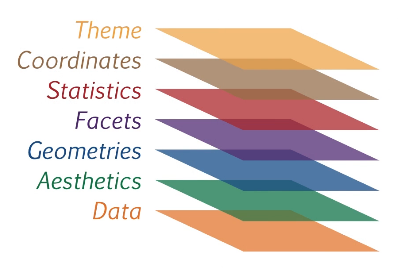

## Tópicos do tutorial

  1. Rever os tutoriais passados de _web scraping_ e _tidyverse_
    
  2. `ggplot2`
    
  3. Gráficos interativos
    
  4. Desafio
    
## Introdução

As informações podem vir de diversas maneiras, sejam por meio de tabelas ou textos. Veremos hoje como transmitir conteúdo com gráficos, especialmente utilizando `ggplot2`, um pacote desenvolvido por Hadley Wickham, o mesmo criador de pacotes como `dplyr`, `rvest` e `readr`, e que atualmente é um dos mais utilizados para visualização gráfica no R. Se ele é um dos mais utilizados significa que existem outros, como por exemplo, `lattice` e `qplot`.

Porém, antes de falarmos sobre gráficos, vamos retomar um pouco da aula passada, pois não é possível criar visualizações sem base de dados, não?


```r
knitr::include_graphics("img/imagem2.jpg")
```


## Web Scraping


```r
library(rvest)
```

```
## Error in library(rvest): there is no package called 'rvest'
```

```r
library(dplyr)
```

```
## Error in library(dplyr): there is no package called 'dplyr'
```

```r
library(readr)
```

```
## Error in library(readr): there is no package called 'readr'
```

Neste tutorial iremos manipular uma [bases de dados]("https://github.com/fivethirtyeight/data/tree/master/bad-drivers") com informação de acidentes de carro nos EUA.


```r
url <- "https://github.com/fivethirtyeight/data/tree/master/bad-drivers"
```

Precisamos começar estruturando O HTML de forma que o R possa interpretá-lo.


```r
pagina <- read_html(url)
```

```
## Error in read_html(url): could not find function "read_html"
```

```r
pagina
```

```
## Error in eval(expr, envir, enclos): object 'pagina' not found
```

Vamos utilizar o `%>%` para ficar mais fácil de emendar as funções. Lembrando que o pipe vai pegar o primeiro argumento da função, que no nosso caso é o objeto `pagina`, e aplicar sobre ele outras funções.


```r
prefixo <- pagina %>%
  html_nodes(xpath = '//td/span/a[@title="bad-drivers.csv"]') %>% 
  html_attr('href')
```

```
## Error in pagina %>% html_nodes(xpath = "//td/span/a[@title=\"bad-drivers.csv\"]") %>% : could not find function "%>%"
```

```r
prefixo
```

```
## Error in eval(expr, envir, enclos): object 'prefixo' not found
```

Para não ficarmos perdidos vamos entender o que aconteceu acima. Nós aplicamos a função `html_nodes` que vai localizar a tag do HTML que temos interesse. Em seguida para obter a informação que queremos vamos obter um atributo especifico da tag desejada.

Em detalhes, a tag `<a>` no HTML serve para criar objetos clicaveis em um site, ou seja, quando clicamos em um link dentro de um site, estamos clicando nesta tag. Porém, ela só irá nos redirecionar para outras paginas se ela tiver o atributo `href` (**h**yper-**ref**erence), que no caso, é a informação que queremos.

Porém, objeto acima nos retornou apenas o fim das url. Precisamos juntar as informações geradas com o link principal `https://github.com`.


```r
link <- paste0("https://github.com", prefixo)
```

```
## Error in paste0("https://github.com", prefixo): object 'prefixo' not found
```

Agora com o link montado vamos ler o HTML e pegar o link para o banco de dados que iramos utilizar.


```r
link_dados <- link %>% read_html() %>% html_node(xpath = '//a[@id="raw-url"]') %>% html_attr('href')
```

```
## Error in link %>% read_html() %>% html_node(xpath = "//a[@id=\"raw-url\"]") %>% : could not find function "%>%"
```


```r
banco_de_dados <- paste0("https://github.com", link_dados)
```

```
## Error in paste0("https://github.com", link_dados): object 'link_dados' not found
```

Com o link em mão podemos abrir o banco de dados


```r
tabela <- read_csv(banco_de_dados)
```

```
## Error in read_csv(banco_de_dados): could not find function "read_csv"
```

Parece que deu certo, não? Quantas linhas e colunas temos?


```r
glimpse(tabela)
```

```
## Error in glimpse(tabela): could not find function "glimpse"
```

Pelo visto temos 8 variáveis, porém apesar de intuitivas para nós, elas são mais chatas para o computador entender, então vamos renomeá-las outros nomes!


```r
tabela <- tabela %>% rename(state = State,
                            n_involved_fatal = `Number of drivers involved in fatal collisions per billion miles`,
                            p_speeding = `Percentage Of Drivers Involved In Fatal Collisions Who Were Speeding`,
                            p_alcohol = `Percentage Of Drivers Involved In Fatal Collisions Who Were Alcohol-Impaired`,
                            p_not_distracted = `Percentage Of Drivers Involved In Fatal Collisions Who Were Not Distracted`,
                            p_not_previous_accident = `Percentage Of Drivers Involved In Fatal Collisions Who Had Not Been Involved In Any Previous Accidents`,
                            car_insurance = `Car Insurance Premiums ($)`,
                            losses_incurred = `Losses incurred by insurance companies for collisions per insured driver ($)`)
```

```
## Error in tabela %>% rename(state = State, n_involved_fatal = `Number of drivers involved in fatal collisions per billion miles`, : could not find function "%>%"
```

```r
colnames(tabela) # nome das colunas
```

```
## Error in is.data.frame(x): object 'tabela' not found
```

Para aqueles que possuem dúvidas sobre o que significa cada variável, vamos dar uma olhada na tabela abaixo:

|variável| descrição|
|--------|----------|
|n_involved_fatal| Número de motoristas envolvidos em colisões fatais por bilhões de milhas|
|p_speeding| Porcentagem de motoristas envolvidos em colisões fatais que estavam em alta velocidade|
|p_not_distracted| Porcentagem de motoristas envolvidos em colisões fatais que não estavam distraídos|
|p_not_previous_accident| Porcentagem de motoristas envolvidos em colisões fatais e que não haviam se envolvido em nenhum acidente prévio|
|car_insurance| Preço do seguro (quanto o motorista paga)|
|losses_incurred| Perdas incorridas pelas companhias de seguros|  

Podemos também incluir outras informações na nossa tabela, como por exemplo, as regiões dos Estados Unidos.


```r
geo_census_areas <- tibble(
   state = c("Connecticut","Maine","Massachusetts","New Hampshire",
             "Rhode Island","Vermont","New Jersey","New York","Pennsylvania",
             "Indiana","Illinois","Michigan","Ohio","Wisconsin","Iowa",
             "Kansas","Minnesota","Missouri","Nebraska","North Dakota",
             "South Dakota","Delaware","District of Columbia","Florida",
             "Georgia","Maryland","North Carolina","South Carolina","Virginia",
             "West Virginia","Alabama","Kentucky","Mississippi","Tennessee",
             "Arkansas","Louisiana","Oklahoma","Texas","Arizona","Colorado",
             "Idaho","New Mexico","Montana","Utah","Nevada","Wyoming",
             "Alaska","California","Hawaii","Oregon","Washington"),
   census_region = c(rep("Northeast Area", 9), rep("Midwest Area", 12),
                     rep("South Area", 17), rep("West Area", 13)),
   divisions = c(rep("New England",6), rep("Middle Atlantic",3), 
                 rep("East North Central",5), rep("West North Central",7),
                 rep("South Atlantic",9), rep("East South Central",4),
                 rep("West South Central",4), rep("Mountain",8),
                 rep("Pacific",5))
)
```

```
## Error in tibble(state = c("Connecticut", "Maine", "Massachusetts", "New Hampshire", : could not find function "tibble"
```

```r
tabela <- left_join(tabela, geo_census_areas, by = c("state"= "state"))
```

```
## Error in left_join(tabela, geo_census_areas, by = c(state = "state")): could not find function "left_join"
```

```r
# Vamos colocar os nomes em ordem crescente para não ter problemas na hora de fazer os gráficos
tabela$state <- factor(tabela$state, levels = tabela$state[order(tabela$state)])
```

```
## Error in factor(tabela$state, levels = tabela$state[order(tabela$state)]): object 'tabela' not found
```

```r
View(tabela)
```

```
## Error in as.data.frame(x): object 'tabela' not found
```

Agora podemos ir ao que interessa, os gráficos!

## `ggplot2`


```r
knitr::include_graphics("img/imagem3.png")
```


Como foi brevemente discutido, visualizações gráficas são muito importantes para transmitir informações, juntanto inclusive elementos da estatística e design para resultar em visualizações que buscam informar e explorar algum fenomêno de interesse.

O `ggplot2` especificamente, foi contruído no que se chamou Grammar of Graphics (por isso __gg__ antes do plot2), que nada mais é do que uma estrutura (framework) para realização de gráficos, que nós também chamamos de `plot`. Além disso, o Grammar of Graphics tem o seguinte principio:

> Gráficos são construídos com diferentes `layers`

Mas o que são `layers`? Layers são elementos (ou componentes) gramáticais utilizados para fazer um _plot_. Estes componentes são importantes para determinar a representação dos dados. Como o Hadley Wickham apontou em um artigo chamado "A layered grammar of graphics" (2010), a associação destes layers com uma certa grámatica auxilia o usuário em atualizar e contruir gráficos com uma facilidade maior.

Os elementos gramáticais que temos no `ggplot2` são:

a. Data - O dado que será plotado, mapeando as variáveis de interesse.

b. Aesthetics - A escala em que o dado será plotado, sinalizando os eixos x e y, cor, tamanho, preenchimento e etc.

c. Geom - Estrutura que será utilizada nos seus dados, como por exemplo, gráfico de dispersão, linha, boxplot e etc.

d. Facets - plotar multiplos grupos

e. Stats - Transformações estatísticas

f. Coordinates System - O espaço no qual o dado sera plotado, como por exemplo, espaço cartesiano, polar e entre outros.

g. Theme - Controle e modificação de aparência de tudo que não diz respeito ao dado utilizado.

h. Scales - Para cada Aesthetics, descreve como a característica visual é convertida em valores, como por exemplo, escala por tamanho, cor e etc.

Caso você queira conhecer mais sobre os layers do `ggplot2` [clique aqui](http://ggplot2.tidyverse.org/index.html)

Chega de falar! Mãos a obra!

A primeira coisa que precisamos fazer é habilitar o pacote do `ggplot2`


```r
library(ggplot2)
```

```
## Error in library(ggplot2): there is no package called 'ggplot2'
```

Como vamos ver os gráficos com `ggplot2` seguem um padrão de _"building blocks"_, ou seja, adicionamos layers sobre layers até que resulte na visualização gráfica desejada.

Vamos então começar com a adição dos layers `data` e `aesthetics`


```r

```


```r
ggplot(data = tabela, aes(x =n_involved_fatal, y = car_insurance))
```

```
## Error in ggplot(data = tabela, aes(x = n_involved_fatal, y = car_insurance)): could not find function "ggplot"
```

Cade os pontos? É só isso? Não!

O código que acabamos de executar apenas mapeia os dados em um plano, ou seja, ele retorna, neste caso um plano cartesiano vazio, com as variáveis e suas respectivas escalas. Para que possamos ver os pontos, temos que adicionar os `geoms` que neste caso será o `geom_point`


```r
knitr::include_graphics("img/montar_grafico_2.png")
```


```r
ggplot(data = tabela, aes(x =losses_incurred, y = car_insurance)) + geom_point()
```

```
## Error in ggplot(data = tabela, aes(x = losses_incurred, y = car_insurance)): could not find function "ggplot"
```

Agora podemos ter uma noção de como o dado se comporta! O que você pode nos dizer sobre esse gráfico? Um palpite pode ser que quanto maior as perdas incorridas pelas companhias de seguros, mais o motorista paga de seguro.

Podemos nos perguntar se essa característica muda de região para região, não é mesmo? Para verificarmos se esta mudança ocorre podemos incluir os `facets`.


```r
knitr::include_graphics("img/montar_grafico_3.png")
```


```r
ggplot(data = tabela, aes(x =n_involved_fatal, y = car_insurance)) + geom_point() + facet_wrap(~census_region)
```

```
## Error in ggplot(data = tabela, aes(x = n_involved_fatal, y = car_insurance)): could not find function "ggplot"
```


```r
ggplot(data = tabela, aes(x =n_involved_fatal, y = car_insurance)) + geom_point() + facet_grid(census_region~.)
```

```
## Error in ggplot(data = tabela, aes(x = n_involved_fatal, y = car_insurance)): could not find function "ggplot"
```


```r
ggplot(data = tabela, aes(x =n_involved_fatal, y = car_insurance)) + geom_point() + facet_grid(.~census_region)
```

```
## Error in ggplot(data = tabela, aes(x = n_involved_fatal, y = car_insurance)): could not find function "ggplot"
```

Como podemos notar, exitem duas funções que são responsáveis por incluir os _facets_ no ggplot2. 

- `facet_wrap`: retorna gráficos dispostos de forma simétrica para cada nível da variável. Como a variável `census_region` tem 4 níveis (Midwest, Northheast, South e West), teremos quatro gráficos dispostos em uma matriz dois por dois (2 linhas e 2 colunas).

- `facet_grid`: irá retornar multiplos gráficos distribuidos na vertical ou na horizontal.

Perceba que tanto no `facet_grid`, quanto no `facet_wrap`, temos que colocar como argumento a variriável antes ou depois de um til (`~`, `.~`, `~.`). Esse `~` e suas variações, significam "dividir o gráfico por [NOME DA VARIÁVEL]". 

Bom destacar que `.~` é diferente de `~.`! Apesar de ambos serem usados apenas no `facet_grid`, o primeiro distribui os gráficos na horizontal, enquanto o segundo na vertical.

Dando continuidade à construção dos gráficos, o próximo layer que iremos utilizar é o `Statistics`. Ele é muito importante para verificarmos distribuições de variáveis, contagem de casos e visualização de odelos estatísticos.


```r
knitr::include_graphics("img/montar_grafico_4.png")
```


### `geom_smooth`

Auxilia na localização de padrões nos dados, como por exemplo, uma reta de uma [regressão linear](https://pt.wikipedia.org/wiki/Regress%C3%A3o_linear)


```r
ggplot(data = tabela, aes(x =n_involved_fatal, y = car_insurance)) + geom_point() + geom_smooth(method = "lm", se = FALSE)
```

```
## Error in ggplot(data = tabela, aes(x = n_involved_fatal, y = car_insurance)): could not find function "ggplot"
```

Os argumentos `method = "lm"` e `se = FALSE`, significam ajustar uma regressão linear nos dados e retirar o intervalo de confiança. Caso você tenha curiosidade, mude o `se` para `se = TRUE` e `method` para `method = "auto"`.

### `geom_bar`

Auxilia na contagem de variáveis, como por exemplo, quantos estados norte americanos estão em cada regiãos do censo demográfico.


```r
ggplot(data = tabela, aes(x =census_region)) + geom_bar()
```

```
## Error in ggplot(data = tabela, aes(x = census_region)): could not find function "ggplot"
```

### `geom_histogram`

Permite obtermos a distribuição de uma variável contínua, como por exemplo, as perdas incorridas pelas companhias de seguro.


```r
ggplot(data = tabela, aes(x =losses_incurred))+geom_histogram()
```

```
## Error in ggplot(data = tabela, aes(x = losses_incurred)): could not find function "ggplot"
```

### `geom_boxplot` e `geom_violin`

Permite obtermos a distribuição de variáveis continuas, porém diferente do histogragrama, o boxplot inclui estatísticas descritivas como a mediana e os quartis.


```r
ggplot(data = tabela, aes(y =losses_incurred, x = census_region)) +geom_boxplot()
```

```
## Error in ggplot(data = tabela, aes(y = losses_incurred, x = census_region)): could not find function "ggplot"
```


```r
ggplot(data = tabela, aes(y =losses_incurred, x = census_region)) +geom_violin()
```

```
## Error in ggplot(data = tabela, aes(y = losses_incurred, x = census_region)): could not find function "ggplot"
```

O próximo layer que iremos ver são as `coordinates`, que no ggplot2 são indicadas por `coord_`. Vamos começar pelo seguinte exemplo,


```r
ggplot(data = tabela, aes(x =factor(1), fill = census_region)) + geom_bar() # Não se preocupe com o fill neste momento veremos ele mais adiante. O importante é saber que ele preenche as colunas com cores padrões do R.
```

```
## Error in ggplot(data = tabela, aes(x = factor(1), fill = census_region)): could not find function "ggplot"
```

O ggplot2 possibilita utilizarmos muitos sistemas de coordenadas, porém focaremos apenas em dois:

- `coord_flip`


```r
ggplot(data = tabela, aes(x =factor(1), fill = census_region)) + geom_bar() + coord_flip()
```

```
## Error in ggplot(data = tabela, aes(x = factor(1), fill = census_region)): could not find function "ggplot"
```

- `coord_polar`


```r
ggplot(data = tabela, aes(x =factor(1), fill = census_region)) + geom_bar() + coord_polar(theta = 'y')
```

```
## Error in ggplot(data = tabela, aes(x = factor(1), fill = census_region)): could not find function "ggplot"
```

Por fim, temos os `Themes`, que modificam tudo aquilo que não é considerado como dado, como por exemplo, a cor do título do gráfico.


```r

```


```r
ggplot(data = tabela, aes(x =losses_incurred, y = car_insurance)) + geom_point()+
  labs(title = "Losses_incurred x Car_insurance",
       subtitle = "Curso de Programação para Ciências Sociais",
       x = "Perdas incorridas", 
       y = "Valor do Seguro", 
       caption = "Fonte: FiveThirtyEight")+ 
  theme(plot.title=element_text(color="blue", size=24, hjust= 0.5),
        axis.title=element_text(size=14,face="bold"),
        axis.ticks.y=element_blank(),
        panel.grid.major.y = element_blank(),
        panel.grid.minor.y = element_blank(),
        panel.grid.minor.x = element_blank(),
        panel.grid.major.x = element_line( size=.8, color="red"))
```

```
## Error in ggplot(data = tabela, aes(x = losses_incurred, y = car_insurance)): could not find function "ggplot"
```


```r
knitr::include_graphics("img/imagem4.jpg")
```


Pensa que acabou? Precisamos ver um pouco mais de `Aesthetics` antes de irmos para os gráficos interativos.

### _Aesthetics mapping_ e _parameter setting_

É muito comum mudarmos algumas características nas variáveis de interesse para diferenciá-las e assim trazer mais informações para o gráfico. Podemos mudar a cor, o tamanho, a forma e entre outras coisas de acordo com a variável que queremos destacar, como por exemplo, o número de envolvidos em acidentes fatais por bilhões de milhas e o preço pago pelos motoristas por regiões do censo demográfico.


```r
ggplot(data = tabela, aes(x = n_involved_fatal, y = car_insurance, color = census_region))+geom_point()
```

```
## Error in ggplot(data = tabela, aes(x = n_involved_fatal, y = car_insurance, : could not find function "ggplot"
```

```r
ggplot(data = tabela, aes(x = n_involved_fatal, y = car_insurance, shape = census_region))+geom_point()
```

```
## Error in ggplot(data = tabela, aes(x = n_involved_fatal, y = car_insurance, : could not find function "ggplot"
```


```r
ggplot(data = tabela, aes(x = n_involved_fatal, y = car_insurance, color = census_region, shape = census_region))+geom_point()
```

```
## Error in ggplot(data = tabela, aes(x = n_involved_fatal, y = car_insurance, : could not find function "ggplot"
```


```r
ggplot(data = tabela, aes(x = n_involved_fatal, y = car_insurance, size = car_insurance))+geom_point()
```

```
## Error in ggplot(data = tabela, aes(x = n_involved_fatal, y = car_insurance, : could not find function "ggplot"
```


Perceba que neste caso nós colocamos os parâmetros dentro de `aes()`. Nós chamamos isto de _aesthetics mapping_, ou seja, o valor do dado determina a característica visual dele, seja cor, tamanho, ou forma. Porém, se nós quisermos um valor constante, na qual a cor seja a mesma para o gráfico inteiro, devemos colocar os parêmetros de cor, forma, tamanho e entre outros fora do `aes()` e sim dentro do geom que estamos utilizando (em alguns casos também funciona colocar dentro do `ggplot()` ainda que fora do `aes()`). Isto se chama de _parameter setting_.


```r
ggplot(data = tabela, aes(x = n_involved_fatal, y = car_insurance))+geom_point(size = 6)
```

```
## Error in ggplot(data = tabela, aes(x = n_involved_fatal, y = car_insurance)): could not find function "ggplot"
```


```r
ggplot(data = tabela, aes(x = n_involved_fatal, y = car_insurance))+geom_point(color = "red")
```

```
## Error in ggplot(data = tabela, aes(x = n_involved_fatal, y = car_insurance)): could not find function "ggplot"
```


```r
ggplot(data = tabela, aes(x = n_involved_fatal, y = car_insurance))+geom_point(alpha = 1/5)
```

```
## Error in ggplot(data = tabela, aes(x = n_involved_fatal, y = car_insurance)): could not find function "ggplot"
```


```r
ggplot(data = tabela, aes(x = n_involved_fatal, y = car_insurance))+geom_point(shape = 7)
```

```
## Error in ggplot(data = tabela, aes(x = n_involved_fatal, y = car_insurance)): could not find function "ggplot"
```

## Gráficos interativos com `Plotly`

Os gráficos interativos no R são construídos com um pacote que se comunica perfeitamente com o `ggplot2`, o `plotly`. Além de ser um pacote muito utilizado não só no R, como também, em Python e Javascript, o [plotly](https://plot.ly/) é uma empresa que fornece serviços de comunicação com dados e como forma de promover seus produtos, eles liberam alguns dos seus códigos para serem utilizados por qualquer pessoa.

Para instalar o pacote, nós utilizamos o `install.packages("plotly")` e depois `library(plotly)` para habilitar as funções disponíveis.


```r
#install.packages("plotly")
library(plotly)
```

```
## Error in library(plotly): there is no package called 'plotly'
```

Feito isso, precisamos fazer um gráfico no `ggplot2` e em seguida usar a função `ggplotly()` para fazer o gráfico interativo.


```r
p <- ggplot(data = tabela, aes(x =losses_incurred, y = car_insurance, color = census_region)) + 
  geom_point(size = 2, shape = 8)
```

```
## Error in ggplot(data = tabela, aes(x = losses_incurred, y = car_insurance, : could not find function "ggplot"
```

```r
ggplotly(p)
```

```
## Error in ggplotly(p): could not find function "ggplotly"
```

## Desafio

As informações que nós utilizamos neste tutorial fazem parte de uma [notícia](https://fivethirtyeight.com/features/which-state-has-the-worst-drivers/) vinculada pelo site __FiveThirtyEight__, site famoso por prever eleições e que atualmente faz parte da rede da ESPN (Sim, o canal de esportes!). 

Os gráficos deste site são muito populares e feitos majoritariamente no R! Que tal nós tentarmos reproduzir um dos gráficos desta notícia? O gráfico abaixo reproduz o primeiro gráfico que aparece na página e o mais legal é que ele serve de padrão para os próximos


```r
ggplot(data = tabela)+
  geom_col(aes(x = state, y = (p_not_distracted*n_involved_fatal)/100), fill = "#FBB506")+
  coord_flip()+
  geom_col(aes(x = state, y = n_involved_fatal), fill ="#FBB506", alpha = 1/2) +
  scale_x_discrete(limits = rev(levels(tabela$state)))+ # Para colocar os Estados em ordem crescente
  ggthemes::theme_fivethirtyeight() + 
  ggthemes::scale_fill_fivethirtyeight()+
  theme(panel.grid.major.y = element_blank(), 
        panel.grid.major.x = element_line( size=.2, color="gray"))+
  labs(title = "Drivers Involved In Fatal Collisions Who Were Not\nDistracted", 
       subtitle = "As a share of number of fatal collisions per billion miles, 2012")
```

```
## Error in ggplot(data = tabela): could not find function "ggplot"
```

Ficou parecido? Sua vez!

