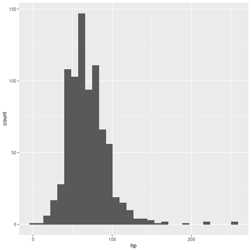
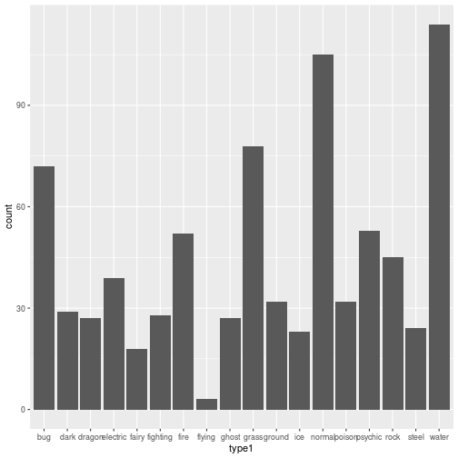

# Introdução ao R

Nesta seção, iremos abordar como (1) instalar o R e o RStudio, (2) realizar operações aritméticas e salvar valores em variáveis, (3) abrir tabelas, (4) retirar estatísticas descritivas e (5) montar um gráfico de barras e um histograma. A ideia é trazer de maneira breve e superficial as funcionalidades do R para que possam ser exploradas posteriormente nas próximas aulas.

## Primeiros passos

### O que é o R?

R é uma linguagem de programação voltada para a análise de dados. Criada por estatísticos, em 1993 ela vem se tornando alplamente utilizada na academia não só para pesquisas nas exatas, mas também nas ciências humanas, como na ciência política, economia, etc. Ela também tem uma entrada em empresas ao lado do SQL e Python.

### Instalando o R e o RStudio

Antes de tudo, vamos nos certificar de que você possui o R e o RStudio instaldos no seu computador. O R pode ser baixado [aqui](https://cloud.r-project.org/). Instale a versão equivalente com o seu sistema operacional. Após esse processo, você deve ser capaz de iniciar o R e obter essa tela.


```r
knitr::include_graphics("r-project-7840-3.jpg")
```


É possível utilizar essa interface para programar em R. Contudo, em geral, preferimos utilizar o RStudio, já quele oferece uma carinha mais limpa e amigável, além de possuir diversas funções bem úteis durante a análise de dados. Para instalá-lo, você pode clicar [aqui](https://www.rstudio.com/). Ao instalá-lo, você obterá essa tela:


```r
knitr::include_graphics("")
```


## Nossas primeiras linhas de código

### Operações aritméticas

Como o R funciona? O R é conhe Todo código escrito no _console_ do R é __avaliado__ pelo interpretador e o resultado é devolvido para você.

Vamos testar isso com algumas operações aritméticas básicas.


```r
1 + 1
```

```
## [1] 2
```


```r
2 - 1
```

```
## [1] 1
```


```r
5 * 5
```

```
## [1] 25
```


```r
9 / 3
```

```
## [1] 3
```

### Variáveis

Porém, isso não parece muito eficiente. E se quiséssemos guardar uma informação para acessá-la posteriormente? Para isso, podemos utilizar __variáveis__.


```r
x <- 2

x * 2
```

```
## [1] 4
```


```r
x <- 3

x / 3
```

```
## [1] 1
```

## Abrindo tabelas no R

Entretando, não queremos fazer apenas isso com o R. O real poder dele aparece durante a análise de dados. Vamos começar carregando um banco de dados no R. Para isso, iremos utilizar o pacote `readr` do `tidyverse`

Mas o que são pacotes e o que é o `tidyverse`? Um pacote contém um conjunto de funções desenvolvidas por outros usuários a fim de realizar uma determinada tarefa. Funções realizam alguma operação sobre um determinado objeto e nos __devolvem__ esse resultado. Por sua vez, o [`tidyverse`](https://www.tidyverse.org/) diz respeito a um conjunto de pacotes criados para facilitar a nossa vida durante a análise de dados. Nos últimos anos, o `tidyverse` revolucionou a maneira que se faz análise no R. Todo o nosso curso irá utilizar o `tidyverse` quando possível.

Agora que sabemos o que é um pacote e uma função. Como carregar um pacote no R? Primeiro precisamos instalá-lo com a função `install.packages()` e depois carregá-lo com o comando `library()`.


```r
install.packages("tidyverse")
```

```
## Installing package into '/home/travis/R/Library'
## (as 'lib' is unspecified)
```

```r
library(tidyverse)
```

```
## ── Attaching packages ────────────────────────────────── tidyverse 1.2.1 ──
```

```
## ✔ tibble  2.1.1     ✔ purrr   0.3.2
## ✔ tidyr   0.8.3     ✔ stringr 1.4.0
## ✔ tibble  2.1.1     ✔ forcats 0.4.0
```

```
## ── Conflicts ───────────────────────────────────── tidyverse_conflicts() ──
## ✖ plotly::filter()        masks dplyr::filter(), stats::filter()
## ✖ readr::guess_encoding() masks rvest::guess_encoding()
## ✖ dplyr::lag()            masks stats::lag()
## ✖ purrr::pluck()          masks rvest::pluck()
```

Uma vez feito isso, podemos utilizar o comando `read_csv` para ler um arquivo `.csv` e transformá-lo em um `data.frame`. Preste atenção pois existe um outro comando `read.csv`. Estamos utilizando aquele com o _ (underline).


```r
read_csv("pokemon.csv")
```

```
## Parsed with column specification:
## cols(
##   .default = col_double(),
##   abilities = col_character(),
##   capture_rate = col_character(),
##   classfication = col_character(),
##   japanese_name = col_character(),
##   name = col_character(),
##   type1 = col_character(),
##   type2 = col_character()
## )
```

```
## See spec(...) for full column specifications.
```

```
## # A tibble: 801 x 41
##    abilities against_bug against_dark against_dragon against_electric
##    <chr>           <dbl>        <dbl>          <dbl>            <dbl>
##  1 ['Overgr…        1               1              1              0.5
##  2 ['Overgr…        1               1              1              0.5
##  3 ['Overgr…        1               1              1              0.5
##  4 ['Blaze'…        0.5             1              1              1  
##  5 ['Blaze'…        0.5             1              1              1  
##  6 ['Blaze'…        0.25            1              1              2  
##  7 ['Torren…        1               1              1              2  
##  8 ['Torren…        1               1              1              2  
##  9 ['Torren…        1               1              1              2  
## 10 ['Shield…        1               1              1              1  
## # … with 791 more rows, and 36 more variables: against_fairy <dbl>,
## #   against_fight <dbl>, against_fire <dbl>, against_flying <dbl>,
## #   against_ghost <dbl>, against_grass <dbl>, against_ground <dbl>,
## #   against_ice <dbl>, against_normal <dbl>, against_poison <dbl>,
## #   against_psychic <dbl>, against_rock <dbl>, against_steel <dbl>,
## #   against_water <dbl>, attack <dbl>, base_egg_steps <dbl>,
## #   base_happiness <dbl>, base_total <dbl>, capture_rate <chr>,
## #   classfication <chr>, defense <dbl>, experience_growth <dbl>,
## #   height_m <dbl>, hp <dbl>, japanese_name <chr>, name <chr>,
## #   percentage_male <dbl>, pokedex_number <dbl>, sp_attack <dbl>,
## #   sp_defense <dbl>, speed <dbl>, type1 <chr>, type2 <chr>,
## #   weight_kg <dbl>, generation <dbl>, is_legendary <dbl>
```

Para um momento para entender o que aconteceu. Essa é a maneira mais interessante de abrir um banco de dados? Qual ação podemos associar a abertura do banco de tal maneira que possamos reutilizá-lo ao longo de nossa análise?

Se você pensou em variáveis, acertou! Sempre devemos salvar bancos e outros dados dentro de variáveis caso haja interesse um utilizá-los continuamente durante a nossa análise.


```r
banco <- read_csv("pokemon.csv")
```

```
## Parsed with column specification:
## cols(
##   .default = col_double(),
##   abilities = col_character(),
##   capture_rate = col_character(),
##   classfication = col_character(),
##   japanese_name = col_character(),
##   name = col_character(),
##   type1 = col_character(),
##   type2 = col_character()
## )
```

```
## See spec(...) for full column specifications.
```

### Pausa para explicação: mas o que são data frames e variáveis?

Data frames é uma estrutura de dados com objetivo de organizar tabelas no R. Ele é bastante parecida com planilhas de Excel.Podemos imaginá-lo como um conjunto de colunas ordenadas, sendo que cada coluna representa uma variável, um atributo, das nossas insformações. No nosso caso, as colunas possuem variáveis sobre cada um dos 801 pokemons.

As variáveis podem ser divididas em dois tipos:

1. Variáveis categóricas: representam características que podem ser descritas em categorias (gênero, nacionalidade, nível de satisfação, etc.). Elas podem ser __nominal__, ou seja, as categorias não possuem uma ordem intrísica (gênero, nacionalidade), ou __ordinal__, as categorias possuem uma ordem (nível de satisfação).

2. Variáveis quantitativas: são representadas por números e, em geral, podem ser do tipo __discretas__ ou __contínuas__.  As discretas são variáveis relacionadas a contagens (número de gols, número de vitórias, número de alunos, etc.). Já as contínuas fazem referências a fenômenos que podem possuir, em tese, infinitos valores (altura, peso, renda, etc.).

Fique atento pois muitas vezes iremos nos referir a variáveis quantitativas apenas como contínuas. Contudo, isso é uma aproximação e não necessariamente é verdade para todos os casos.

### De volta para as análises!

Agora que temos o nosso banco salvo em uma variável, podemos começar a extrair algumas informações. Vamos começar pelo básico. Que tal dar uma olhada por cima do banco? Para isso, utilizamos a função `head()`. Ela extrai e imprimi na nossa tela as primeiras linhas do nosso banco. 


```r
head(banco)
```

```
## # A tibble: 6 x 41
##   abilities against_bug against_dark against_dragon against_electric
##   <chr>           <dbl>        <dbl>          <dbl>            <dbl>
## 1 ['Overgr…        1               1              1              0.5
## 2 ['Overgr…        1               1              1              0.5
## 3 ['Overgr…        1               1              1              0.5
## 4 ['Blaze'…        0.5             1              1              1  
## 5 ['Blaze'…        0.5             1              1              1  
## 6 ['Blaze'…        0.25            1              1              2  
## # … with 36 more variables: against_fairy <dbl>, against_fight <dbl>,
## #   against_fire <dbl>, against_flying <dbl>, against_ghost <dbl>,
## #   against_grass <dbl>, against_ground <dbl>, against_ice <dbl>,
## #   against_normal <dbl>, against_poison <dbl>, against_psychic <dbl>,
## #   against_rock <dbl>, against_steel <dbl>, against_water <dbl>,
## #   attack <dbl>, base_egg_steps <dbl>, base_happiness <dbl>,
## #   base_total <dbl>, capture_rate <chr>, classfication <chr>,
## #   defense <dbl>, experience_growth <dbl>, height_m <dbl>, hp <dbl>,
## #   japanese_name <chr>, name <chr>, percentage_male <dbl>,
## #   pokedex_number <dbl>, sp_attack <dbl>, sp_defense <dbl>, speed <dbl>,
## #   type1 <chr>, type2 <chr>, weight_kg <dbl>, generation <dbl>,
## #   is_legendary <dbl>
```

Outra função que podemos utilizar para ter uma noção geral do nosso banco é a `glimpse()`


```r
glimpse(banco)
```

```
## Observations: 801
## Variables: 41
## $ abilities         <chr> "['Overgrow', 'Chlorophyll']", "['Overgrow', '…
## $ against_bug       <dbl> 1.00, 1.00, 1.00, 0.50, 0.50, 0.25, 1.00, 1.00…
## $ against_dark      <dbl> 1, 1, 1, 1, 1, 1, 1, 1, 1, 1, 1, 1, 1, 1, 1, 1…
## $ against_dragon    <dbl> 1, 1, 1, 1, 1, 1, 1, 1, 1, 1, 1, 1, 1, 1, 1, 1…
## $ against_electric  <dbl> 0.5, 0.5, 0.5, 1.0, 1.0, 2.0, 2.0, 2.0, 2.0, 1…
## $ against_fairy     <dbl> 0.5, 0.5, 0.5, 0.5, 0.5, 0.5, 1.0, 1.0, 1.0, 1…
## $ against_fight     <dbl> 0.50, 0.50, 0.50, 1.00, 1.00, 0.50, 1.00, 1.00…
## $ against_fire      <dbl> 2.0, 2.0, 2.0, 0.5, 0.5, 0.5, 0.5, 0.5, 0.5, 2…
## $ against_flying    <dbl> 2.0, 2.0, 2.0, 1.0, 1.0, 1.0, 1.0, 1.0, 1.0, 2…
## $ against_ghost     <dbl> 1, 1, 1, 1, 1, 1, 1, 1, 1, 1, 1, 1, 1, 1, 1, 0…
## $ against_grass     <dbl> 0.25, 0.25, 0.25, 0.50, 0.50, 0.25, 2.00, 2.00…
## $ against_ground    <dbl> 1.0, 1.0, 1.0, 2.0, 2.0, 0.0, 1.0, 1.0, 1.0, 0…
## $ against_ice       <dbl> 2.0, 2.0, 2.0, 0.5, 0.5, 1.0, 0.5, 0.5, 0.5, 1…
## $ against_normal    <dbl> 1, 1, 1, 1, 1, 1, 1, 1, 1, 1, 1, 1, 1, 1, 1, 1…
## $ against_poison    <dbl> 1.0, 1.0, 1.0, 1.0, 1.0, 1.0, 1.0, 1.0, 1.0, 1…
## $ against_psychic   <dbl> 2, 2, 2, 1, 1, 1, 1, 1, 1, 1, 1, 1, 2, 2, 2, 1…
## $ against_rock      <dbl> 1, 1, 1, 2, 2, 4, 1, 1, 1, 2, 2, 4, 2, 2, 2, 2…
## $ against_steel     <dbl> 1.0, 1.0, 1.0, 0.5, 0.5, 0.5, 0.5, 0.5, 0.5, 1…
## $ against_water     <dbl> 0.5, 0.5, 0.5, 2.0, 2.0, 2.0, 0.5, 0.5, 0.5, 1…
## $ attack            <dbl> 49, 62, 100, 52, 64, 104, 48, 63, 103, 30, 20,…
## $ base_egg_steps    <dbl> 5120, 5120, 5120, 5120, 5120, 5120, 5120, 5120…
## $ base_happiness    <dbl> 70, 70, 70, 70, 70, 70, 70, 70, 70, 70, 70, 70…
## $ base_total        <dbl> 318, 405, 625, 309, 405, 634, 314, 405, 630, 1…
## $ capture_rate      <chr> "45", "45", "45", "45", "45", "45", "45", "45"…
## $ classfication     <chr> "Seed Pokémon", "Seed Pokémon", "Seed Pokémon"…
## $ defense           <dbl> 49, 63, 123, 43, 58, 78, 65, 80, 120, 35, 55, …
## $ experience_growth <dbl> 1059860, 1059860, 1059860, 1059860, 1059860, 1…
## $ height_m          <dbl> 0.7, 1.0, 2.0, 0.6, 1.1, 1.7, 0.5, 1.0, 1.6, 0…
## $ hp                <dbl> 45, 60, 80, 39, 58, 78, 44, 59, 79, 45, 50, 60…
## $ japanese_name     <chr> "Fushigidaneフシギダネ", "Fushigisouフシギソウ", "Fushig…
## $ name              <chr> "Bulbasaur", "Ivysaur", "Venusaur", "Charmande…
## $ percentage_male   <dbl> 88.1, 88.1, 88.1, 88.1, 88.1, 88.1, 88.1, 88.1…
## $ pokedex_number    <dbl> 1, 2, 3, 4, 5, 6, 7, 8, 9, 10, 11, 12, 13, 14,…
## $ sp_attack         <dbl> 65, 80, 122, 60, 80, 159, 50, 65, 135, 20, 25,…
## $ sp_defense        <dbl> 65, 80, 120, 50, 65, 115, 64, 80, 115, 20, 25,…
## $ speed             <dbl> 45, 60, 80, 65, 80, 100, 43, 58, 78, 45, 30, 7…
## $ type1             <chr> "grass", "grass", "grass", "fire", "fire", "fi…
## $ type2             <chr> "poison", "poison", "poison", NA, NA, "flying"…
## $ weight_kg         <dbl> 6.9, 13.0, 100.0, 8.5, 19.0, 90.5, 9.0, 22.5, …
## $ generation        <dbl> 1, 1, 1, 1, 1, 1, 1, 1, 1, 1, 1, 1, 1, 1, 1, 1…
## $ is_legendary      <dbl> 0, 0, 0, 0, 0, 0, 0, 0, 0, 0, 0, 0, 0, 0, 0, 0…
```

Quais informações chamam a sua atenção?

Podemos ver diversas informações, como nome (`name`), pontos de vida (`hp`), pontos de ataque (`attack`), pontos de defesa (`defense`), entre outras informações.

Contudo, olhar o banco por inteiro quase nunca é um processo eficiente de análise. Nós sempre queremos resumir as informações presentes no nosso banco de dados de alguma maneira. Em geral, uma forma de fazer isso é por meio de estatísticas descritivas (média, desvio padrão, correlação, quartis, etc.). Por exemplo, qual a média de pontos de vida para todos os pokemons? Quais categorias de pokemons são mais frequentes?


```r
mean(banco$hp)
```

```
## [1] 68.9588
```

### Pausa para explicação: por que o $?

Você entendeu porque utilizamos o `$` aqui? Lembra que o `data.frame` nada mais é do que um conjunto de colunas uma atrás da outra? Então, com o `$` podemos acessar uma dessas colunas e calcular, por exemplo, a média dos valores presente nela. Como queremos a média dos pontos de vida, utilizamos `banco$hp`. Em outro caso, poderíamos tirar a média dos pontos de ataque. Para isso, utilizaríamos `banco$attack`.

### De volta para as análises

Vamos agora ver a distribuição dos tipos de pokemons (`type1`).


```r
table(banco$type1)
```

```
## 
##      bug     dark   dragon electric    fairy fighting     fire   flying 
##       72       29       27       39       18       28       52        3 
##    ghost    grass   ground      ice   normal   poison  psychic     rock 
##       27       78       32       23      105       32       53       45 
##    steel    water 
##       24      114
```

Legal, não? Porém, a tabela não está organizada em ordem crescente nem decrescente. Podemos concertar isso com uma função chamada `sort()`.


```r
tabeça_type1 <- table(banco$type1)
sort(tabeça_type1)
```

```
## 
##   flying    fairy      ice    steel   dragon    ghost fighting     dark 
##        3       18       23       24       27       27       28       29 
##   ground   poison electric     rock     fire  psychic      bug    grass 
##       32       32       39       45       52       53       72       78 
##   normal    water 
##      105      114
```

Bem melhor!

Ainda falta muita coisas para vermos durante o nosso curso, mas você já aprendeu a abrir um banco de dados e a gerar estatísticas descritivas.

## Gráficos

Números são legais e normalmente trazem _insights_ sobre a distribuição dos nossos dados. Contudo, durante uma análise, gráficos são extremamente poderosos uma vez que informam sobre a dispersão e a centralidade dos nossos valores com um simples olhar.

É possível criar gráficos no R sem utilizar pacotes externos. Entretanto, o `ggplot2` é muito poderoso e nos permite fazer praticamente qualquer coisa, ao estabelecer uma gramática para dispor informações. O objetivo da aula de hoje não é avaliar a fundo as funcionalidades desse pacote. Logo tente apenas entender a linguagem para alguns gráficos simples.

Que tal observar a distribuição dos dados acessados anteriormente?

### Variáveis contínuas

Uma maneira de fazer isso 


```r
ggplot(banco,
       mapping = aes(x = hp)) +
  geom_histogram()
```

```
## `stat_bin()` using `bins = 30`. Pick better value with `binwidth`.
```



### Variáveis categóricas

Por outro lado, para variáveis categóricas, podemos utilizar gráficos de barras.


```r
ggplot(banco, mapping = aes(x = type1)) + 
  geom_bar()
```



## Exercícios

1. O que é uma função? O que é um pacote?

2. Em que devo guardar um valor para que eu possa acessá-lo posteriormente?

3. Escolha 2 variáveis categóricas e 2 variáveis contínuas que te chamem atenção. Agora, retire algumas estatísticas descritivas (média, desvio padrão, etc.) e faça um gráfico de acordo o tipo da variável.
