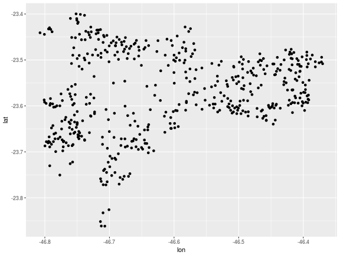

Data frames foram, até este momento do curso, o protagonista de nossa análise de dados. Vimos como manipular dados que estão sempre no mesmo formato

## Informação espacial armazenada em data frames - pontos no google maps

Vamos começar a trabalhar com mapas a partir de um exemplo que, veremos, utilizará as ferramentas que aprendemos até então para produzir nossos primeiros mapas. Para tanto, vamos utilizar o cadastro de escolas que a Prefeitura Municipal de São Paulo disponibiliza [aqui](http://dados.prefeitura.sp.gov.br/).

Nossa primeira tarefa é baixar os dados e faremos isso de forma inteligente e sem "cliques". A partir do url do arquivo do cadastro, que guardaremos no objeto "url\_cadastros\_escolas", faremos o download do arquivo e guardaremos o arquivo .csv baixado como o nome "temp.csv":


```r
url_cadastros_escolas <- "http://dados.prefeitura.sp.gov.br/dataset/8da55b0e-b385-4b54-9296-d0000014ddd5/resource/39db5031-7238-4139-bcaa-e620a3180188/download/escolasr34fev2017.csv"
download.file(url_cadastros_escolas, "temp.csv")
```

Veja que baixar o arquivo diretamente no R é preferível ao processo manual, pois podemos rapidamente reproduzir o processo, além de documentá-lo. Vamos abrir o arquivo:


```r
library(readr)

escolas <- read_delim("temp.csv", delim = ";")
```

Explore o arquivo com o comando _glimpse_:


```r
library(dplyr)

glimpse(escolas)
```

```
## Observations: 5,324
## Variables: 51
## $ DRE         <chr> "G", "FO", "MP", "BT", "PJ", "BT", "FO", "JT", "JT...
## $ CODESC      <chr> "000086", "000094", "000108", "000191", "000205", ...
## $ TIPOESC     <chr> "EMEI", "EMEI", "EMEF", "EMEF", "EMEBS", "EMEI", "...
## $ NOMESC      <chr> "PAULO CAMILHIER FLORENCANO", "VICENTE PAULO DA SI...
## $ DIRETORIA   <chr> "GUAIANASES", "FREGUESIA/BRASILANDIA", "SAO MIGUEL...
## $ SUBPREF     <chr> "GUAIANASES", "CASA VERDE/CACHOEIRINHA", "SAO MIGU...
## $ CEU         <chr> NA, NA, NA, NA, NA, NA, NA, NA, NA, NA, NA, NA, NA...
## $ ENDERECO    <chr> "RUA FELICIANO DE MENDON\xc7A", "RUA DOUTOR FLEURY...
## $ NUMERO      <chr> "502", "295", "159", "140", "206", "90", "51", "34...
## $ BAIRRO      <chr> "JARDIM S\xc3O PAULO(ZONA LESTE)", "VILA SANTA MAR...
## $ CEP         <chr> "08460365", "02563010", "08090290", "05742100", "0...
## $ TEL1        <chr> "25578348", "39813227", "25865294", "58450121", "3...
## $ TEL2        <chr> "25571947", NA, "25811484", NA, "39067229", NA, NA...
## $ FAX         <chr> "25571947", NA, NA, "58450121", NA, "58425113", "3...
## $ SITUACAO    <chr> "Ativa", "Ativa", "Ativa", "Ativa", "Ativa", "Ativ...
## $ CODDIST     <chr> "31", "50", "44", "94", "63", "94", "29", "89", "8...
## $ DISTRITO    <chr> "GUAIANASES", "LIMAO", "JARDIM HELENA", "VILA SONI...
## $ SETOR       <chr> "3103", "5002", "4402", "9404", "6301", "9404", "2...
## $ CODINEP     <int> 35098711, 35098361, 35098760, 35098462, 35079029, ...
## $ CODCIE      <chr> "098711", "098361", "098760", "098462", "079029", ...
## $ EH          <dbl> 1.610781e+14, 1.610702e+14, 1.610771e+14, 1.610792...
## $ DT_CRIACAO  <chr> "13/06/1988", "04/07/1988", "05/07/1988", "27/05/1...
## $ ATO_CRIACAO <chr> "26.134", "26.314", "26.312", "26.003", "26.229", ...
## $ DOM_CRIACAO <chr> "13/06/1988", "04/07/1988", "05/07/1988", "27/05/1...
## $ DT_INI_FUNC <chr> "22/09/1988", "01/08/1988", "01/09/1988", "02/10/1...
## $ DT_AUTORIZA <chr> "16/03/1991", "16/03/1991", "13/03/2001", "16/03/1...
## $ NOME_ANT    <chr> NA, NA, "VILA NITRO OPERARIA", NA, NA, NA, "INSTAL...
## $ T2D3D       <chr> "2D", "2D", "2D", "2D", "2D", "2D", "2D", "2D", "2...
## $ T2D3D15     <chr> "2D", "2D", "2D", "2D", "2D", "2D", "2D", "2D", "2...
## $ T2D3D14     <chr> "2D", "2D", "2D", "2D", "2D", "2D", "2D", "2D", "2...
## $ T2D3D13     <chr> "2D", "2D", "2D", "2D", "2D", "2D", "2D", "2D", "2...
## $ T2D3D12     <chr> "2D", "2D", "2D", "2D", "2D", "2D", "2D", "2D", "2...
## $ T2D3D11     <chr> "2D", "2D", "2D", "2D", "2D", "2D", "2D", "2D", "2...
## $ T2D3D10     <chr> "2D", "2D", "2D", "2D", "2D", "2D", "2D", "2D", "2...
## $ T2D3D09     <chr> "2D", "2D", "2D", "2D", "2D", "2D", "2D", "2D", "3...
## $ T2D3D08     <chr> "3D", "3D", "2D", "2D", "2D", "3D", "2D", "2D", "3...
## $ T2D3D07     <chr> "3D", "3D", "3D", "2D", "2D", "3D", "2D", "3D", "3...
## $ DTURNOS     <chr> "2D", "3D", "3D", "2D", "2D", "3D", "3D", "3D", "3...
## $ DTURNOS15   <chr> "MT", "MT", "MT", "MT", "MT", "MT", "MT", "MT", "M...
## $ DTURNOS14   <chr> "MT", "MT", "MT", "MT", "MT", "MT", "MT", "MT", "M...
## $ DTURNOS13   <chr> "MT", "MT", "MT", "MT", "MT", "MT", "MT", "MT", "M...
## $ DTURNOS12   <chr> "MT", "MT", "MT", "MT", "MTN", "MT", "MT", "MT", "...
## $ DTURNOS11   <chr> "MT", "MT", "MT", "MT", "MTN", "MT", "MT", "MT", "...
## $ DTURNOS10   <chr> "MT", "MT", "MTN", "MT", "MTN", "MT", "MT", "MT", ...
## $ DTURNOS09   <chr> "MT", "MT", "MTN", "MT", "MTN", "MT", "MT", "MT", ...
## $ DTURNOS08   <chr> "MT", "MT", "MTN", "MT", "MTN", "MT", "MT", "MT", ...
## $ DTURNOS07   <chr> "MIV", "MIV", "MTN", "MT", "MTN", "MIV", "MT", "MT...
## $ LATITUDE    <int> -23553905, -23489728, -23478312, -23612237, -23486...
## $ LONGITUDE   <int> -46398452, -46670198, -46427344, -46749888, -46733...
## $ REDE        <chr> "DIR", "DIR", "DIR", "DIR", "DIR", "DIR", "DIR", "...
## $ DATABASE    <chr> "28/02/2017", "28/02/2017", "28/02/2017", "28/02/2...
```

Não há nada de extraordinário no arquivo, que se assemelha aos que vimos até então. Há, porém, uma dupla de variáveis que nos permite trabalhar "geograficamente" com o dado: LATITUDE e LONGITUDE. "Lat e Long" são a informação fundamental de um dos sistemas de coordenadas (_coordinate reference system_, CRS) mais utilizados para localização de objetos na superfície da terra.

Por uma razão desconhecida, a informação fornecida pela PMSP (Prefeitura Municipal de São Paulo) está em formato diferente do convencional. Latitudes são representadas por números entre -90 e 90, com 8 casas decimais, e Longitudes por números entre -180 e 180, também com 8 casas decimais. Em nosso par de variáveis, o separador de decimal está omitido e por esta razão faremos um pequena modificação na variável. Aproveitaremos também para renomear algumas variáveis de nosso interesse -- como tipo da escola (CEI, EMEI, EMEF, CEU, etc) e o ano de início do funcionamento -- e selecionaremos apenas as linhas referentes a EMEF (Escolas Municipal de Ensino Fundamental):


```r
emef <- escolas  %>%
  rename(lat = LATITUDE, lon = LONGITUDE, tipo = TIPOESC) %>% 
  mutate(lat = lat / 1000000, 
         lon = lon / 1000000,
         ano = as.numeric(substr(DT_INI_FUNC, 7, 10))) %>%
  filter(tipo == "EMEF")
```

Pronto! Temos agora uma informação geográfica das EMEFs e uma variável de interesse -- ano -- que utilizaremos para investigar a expansão da rede.

Vamos construir um primeiro mapa, usando a função que conhecemos -- ggplot -- a partir das informações de latitude e longitude das escolas:


```r
library(ggplot2)

ggplot(aes(lon, lat), data = emef) +
  geom_point()
```



Veja que podemos "imaginar" o formato da cidade de São Paulo com os pontos, mas o mapa não é propriamente um mapa. Falta uma "camada" básica, sobre a qual os pontos serão desenhados.

Vamos utilizar o pacote _ggmap_, que é um pacote para visualização de dados espaciais com o pacote _ggplot2_ para obter tal "camada". Com a função _get\_map_, faremos o download de um mapa que servirá de base para os pontos das EMEFs.

A função _get\_map_ requer como argumento principal um par de coordenadas a partir do qual o mapa será centralizado. No nosso exemplo vamos utilizar as coordenadas da Praça da Sé, que serão armazenadas em um vetor. É fácil obter coordenadas de um local a partir de serviços de localização na internet.


```r
library(ggmap)
```

```
## Error in library(ggmap): there is no package called 'ggmap'
```

```r
se <- c(lon = -46.6362714, lat = -23.5500806)
```

Com as coordenadas da Praça de Sé, vamos obter um mapa de São Paulo:


```r
map_sp <- get_map(se)
```

```
## Error in get_map(se): could not find function "get_map"
```

```r
plot(map_sp)
```

```
## Error in plot(map_sp): object 'map_sp' not found
```

Por padrão, _get\_map_ retorna um mapa de "terreno" e utiliza a API da Google, com zoom e escala automáticos.

Antes de alterar estes argumentos, vamos utilizar uma função "irmã" à _ggplot_, _ggmap_, para juntar o mapa de São Paulo com os pontos das escolas:


```r
ggmap(map_sp) +
  geom_point(aes(lon, lat), data = emef)
```

```
## Error in ggmap(map_sp): could not find function "ggmap"
```

Feio ainda, porém bastante mais informativo. Veja que combinamos duas fontes de dados: o cadastro da PMSP e um mapa obtido na API da Google.

Vamos obter mapas mais interessantes com _get\_map_. Em primeiro lugar, podemos variar os tipos de mapas (argumento "maptype") e obter qualquer um dentre as seguintes opções: "terrain", "terrain-background", "satellite", "roadmap", "hybrid", "toner", "watercolor", "terrain-labels", "terrain-lines", "toner-2010", "toner-2011", "toner-background", "toner-hybrid", "toner-labels", "toner-lines" e "toner-lite".

Também podemos variar a API -- argumento "source" -- na qual o mapa será obtido: Google ("google"), Open Street Maps ("osm") ou Stamen ("stamen"). Nem todas as "source" e "maptypes" podem ser combinados e os "toner" provêm da API Stamen.

Vejamos alguns exemplos (note o uso do operador "pipe") abaixo:


```r
# Terrain Google
get_map(se, source = "google", maptype = "terrain") %>%
  ggmap() +
  geom_point(aes(lon, lat), data = emef)

# Roadmap Google
get_map(se, source = "google", maptype = "roadmap") %>%
  ggmap() +
  geom_point(aes(lon, lat), data = emef)

# Toner Stamen
get_map(se, source = "stamen", maptype = "toner") %>%
  ggmap() +
  geom_point(aes(lon, lat), data = emef)
```

Vamos alterar o zoom dos mapas e obter apenas mapas e ver o efeito:


```r
get_map(se, source = "google", maptype = "roadmap", zoom = 6) %>%
  ggmap() +
  geom_point(aes(lon, lat), data = emef)

get_map(se, source = "google", maptype = "roadmap", zoom = 10) %>%
  ggmap() +
  geom_point(aes(lon, lat), data = emef)

get_map(se, source = "google", maptype = "roadmap", zoom = 11) %>%
  ggmap() +
  geom_point(aes(lon, lat), data = emef)

get_map(se, source = "google", maptype = "roadmap", zoom = 14) %>%
  ggmap() +
  geom_point(aes(lon, lat), data = emef)

get_map(se, source = "google", maptype = "roadmap", zoom = 18) %>%
  ggmap() +
  geom_point(aes(lon, lat), data = emef)
```

Note que, quando estão fora da base, os pontos são descartados da visualização e obtemos um "warning".

Convém, por conta da gramática da família de funções _ggplot_, definir uma camada básica na função _ggmap_, que, no nosso caso, são os pontos que estão em análise (e não a camada de mapa que (sic) dá base à visualização):


```r
map_sp <- get_map(se, source = "google", maptype = "roadmap", zoom = 11)
```

```
## Error in get_map(se, source = "google", maptype = "roadmap", zoom = 11): could not find function "get_map"
```

```r
ggmap(map_sp, 
      base_layer = ggplot(aes(lon, lat), data = emef)) +
  geom_point()
```

```
## Error in ggmap(map_sp, base_layer = ggplot(aes(lon, lat), data = emef)): could not find function "ggmap"
```

Finalmente, vamos usar uma informação sobre as escolas para diferenciar os pontos. Os dados do cadastro não trazem informações muito interessantes sobre a escola e por isso utilizaremos o ano de criação. Em nosso desafio seguinte trabalharemos com informações sobre a escola que vêm de outra base do mesmo portal da prefeitura.

Introduziremos em nosso mapa uma escala de cores para diferenciar as EMEFs por ano de criação:


```r
map_sp <- get_map(se, source = "google", maptype = "roadmap", zoom = 12)
```

```
## Error in get_map(se, source = "google", maptype = "roadmap", zoom = 12): could not find function "get_map"
```

```r
ggmap(map_sp, 
      base_layer = ggplot(aes(lon, lat, color = ano), data = emef)) +
  geom_point()
```

```
## Error in ggmap(map_sp, base_layer = ggplot(aes(lon, lat, color = ano), : could not find function "ggmap"
```

Como era de se esperar, os pontos mais claros na cidade estão nos extremos e as EMEFs mais antigas, e geral, nos bairros que consolidaram mais cedo no processo de urbanização.

## Procurando Lat e Long com o pacote ggmap

E quando temos apenas o endereço dos locais que queremos encontrar? Bem, há alternativas oferecidas pelo próprio pacote _ggmap_.

Vamos agora criar um novo data frame a partir dos dados do cadastro da PMSP que contém apenas os CEUs. Vamos juntar todas as informações de endereço e agregar a elas o texto ", Sao Paulo, Brazil"


```r
ceu <- escolas  %>%
  filter(TIPOESC == "CEU") %>%
  mutate(endereco = paste(ENDERECO, NUMERO, BAIRRO, CEP, ", Sao Paulo, Brazil"))
```

Com a função _geocode_, procuraremos a latitude e longitude dos 46 CEUs. Vamos ver o exemplo do primeiro CEU:


```r
ceu1 <- geocode(ceu$endereco[1])
```

```
## Error in geocode(ceu$endereco[1]): could not find function "geocode"
```

```r
ggmap(map_sp, 
      base_layer = ggplot(aes(lon, lat), data = ceu1)) +
  geom_point()
```

```
## Error in ggmap(map_sp, base_layer = ggplot(aes(lon, lat), data = ceu1)): could not find function "ggmap"
```

Usando o que já havíamos visto, obtivemos um mapa com um único ponto. De fato, se procurarmos a informação deste CEU (CEU Alvarenga), veremos que obtivemos a latitude e longitude corretas.

Com um _for loop_, procuraremos a latitude e longitude dos 46 endereços:


```r
# Para remover problemas com enconding, removi algumas observacoes usando
# as linhas marcadas como comentario abaixo. No Windows pode ser desnecessario
ceu$endereco <- iconv(ceu$endereco, to = "ASCII//TRANSLIT")
ceu <- ceu[!is.na(ceu$endereco),]
latlong <- data.frame()
for (i in 1:nrow(ceu)){
  latlong <- bind_rows(latlong, geocode(ceu$endereco[i]))
}
```

```
## Error in geocode(ceu$endereco[i]): could not find function "geocode"
```

```r
ceu <- bind_cols(ceu, latlong)
```

Simples, não! O principal problema da função _geocode_ é que há um limite de consultas por conta dos termos da Google Maps API. A alternativa é usar como argumento "source = 'dsk'" [Data Science Toolkit](http://www.datasciencetoolkit.org/about), que reune uma série de fontes de dados e utiliza outra API para a consulta de latitude e longitude de logradouros.

Vamos agora elaborar um mapa com os pontos obtidos para cada CEU:


```r
ggmap(map_sp, 
      base_layer = ggplot(aes(lon, lat), data = ceu)) +
  geom_point()
```

```
## Error in ggmap(map_sp, base_layer = ggplot(aes(lon, lat), data = ceu)): could not find function "ggmap"
```

## Pontos, linhas, polígonos e classes sp

Em nossos exemplos utilizamos _data frames_ para armazenar as informações espaciais. Isso foi possível por que, ao trabalharmos com latitude e longitude de pontos, ficamos limitados a um único sistema de coordenadas e tampouco precisamos de mais de uma linha do data frame para armazenar o "desenho" de um objeto (ponto) em um mapa.

Há vários sistemas de coordenadas utilizados em diferentes bases de dados cartográficas. Assim, por um lado, precisamos de métodos que nos permitam transformar um sistema em outro para combinar diferentes fontes de dados. Dados especiais armazenados em data frames não contêm referência alguma ao sistema de coordenadas ao qual pertencem.

Por outro lado, se precisarmos de mapas que incluem outras representações geométricas, como linhas e pontos, somos obrigados a multiplicar o número de linhas em um data frame pelo número de vértices de tais figuras (2 vezes para uma linha e _n_ vezes para um polígono, onde _n_ é o número de vértices do polígono). Esse método, ainda que possível, é muito ineficiente.

A solução é trabalharmos com classes de objetos mais complexas (e completas) do que data frames. Vamos falar sobre isso ao explorarmos as principais classes do pacote _sp_. Em nosso tutorial vamos trabalhar com as classes de objetos do pacote _sp_ e om as funções disponíveis para sua manipulação.

Antes disso, porém, vamos conhecer o formato mais comum para armazenar dados espaciais -- _shapefile_ -- e como abri-los em R.

### Shapefiles


```r
library(sp)
```

```
## Error in library(sp): there is no package called 'sp'
```

Ademais de precisarmos de outras classes de objetos em R para armazenarmos informação espacial, precisamos também de formatos de arquivos diferentes para compartilhar dados espaciais. _Shapefiles_ são os mais populares e diversos repositórios de dados espaciais, como a [Prefeitura de São Paulo](http://www.prefeitura.sp.gov.br/cidade/secretarias/urbanismo/dados_estatisticos/index.php?p=160798) e 
o [Centro de Estudos da Metrópole (CEM)](http://www.fflch.usp.br/centrodametropole/).

Nosso primeiro exemplo foi retirado do site do CEM e ligeiramente modificado. Sugiro que você dê uma olhada nas bases cartográficas do CEM, pois há bastante coisa interessante lá.

Vamos começar fazendo o download do arquivo .zip onde estão os dados:


```r
url_shp_eleicoes_sp <- "https://github.com/leobarone/FLS6397/raw/master/data/rmsp.zip"
download.file(url_shp_eleicoes_sp, "temp.zip")
unzip("temp.zip")
```

Veja que o arquivo descompactado é uma pasta ("rmsp") com arquivos de diversas extensões. Não vamos entrar nos detalhes dos arquivos. Quando falamos de "shapefile", estamos nos referindo a arquivos .shp. Mas raramente ele vem desacompanhado. A informação que nos importa é: todos eles, exceto, obviamente, o arquivo em .pdf, farão parte do objeto que criaremos.


```r
list.files("rmsp")
```

```
## [1] "MunRM07.dbf" "MunRM07.pdf" "MunRM07.shp" "MunRM07.shx"
```

É fundamental que os arquivos de diferentes extensões tenham o mesmo nome, inclusive maiúsculas e minúsculas, e que os nomes das extensões estejam em letras minúsculas. Por esta razão, tome cuidado ao usar os arquivos do CEM e da PMSP, pois, em geral, algum arquivo vem com o nome e extensão em letras maiúscula.

A biblioteca para abertura de dados espaciais em R é _rgdal_. _readORG_, função de _rgdal_ que utilizaremos para abrir os dados, recebe dois argumentos: a pasta em que estão os arquivos -- no nosso caso "rmsp", e o nome dos arquivos sem extensão (e por esta razão é fundamental que tenham o mesmo nome):


```r
library(rgdal)
```

```
## Error in library(rgdal): there is no package called 'rgdal'
```

```r
rmsp <- readOGR("rmsp", "MunRM07")
```

```
## Error in readOGR("rmsp", "MunRM07"): could not find function "readOGR"
```

Vamos observar a classe do objeto importado:


```r
class(rmsp)
```

```
## Error in eval(expr, envir, enclos): object 'rmsp' not found
```

"SpatialPolygonsDataFrame" é, como é fácil deduzir, um objeto espacial que contém polígonos (municípios da Região Metropolitana de São Paulo) e que acompanha um data frame. Falaremos sobre essa classe de objetos a seguir.

Tal classe de objetos pode ser rapidamente visualizada utilizando o comando _plot_:


```r
plot(rmsp)
```

```
## Error in plot(rmsp): object 'rmsp' not found
```

Podemos utilizar o pacote _ggplot2_ e sua gramática para plotar objetos da classe "SpatialPolygonsDataFrame":


```r
ggplot(data = rmsp, 
       aes(x = long, y = lat, group = group)) + 
  geom_polygon(color = 'white', fill = 'darkgrey') +
  coord_map()
```

```
## Error in ggplot(data = rmsp, aes(x = long, y = lat, group = group)): object 'rmsp' not found
```

#### Exercício:

Vá a uma das duas fontes de mapas indicadas -- [Prefeitura de São Paulo](http://www.prefeitura.sp.gov.br/cidade/secretarias/urbanismo/dados_estatisticos/index.php?p=160798) ou  [Centro de Estudos da Metrópole (CEM)](http://www.fflch.usp.br/centrodametropole/) -- importe os dados e produza um mapa. Dependendo do tema que você escolher, você produzirá mapas com polígonos (por exemplo, mapas de divisões políticas ou administrativas), linhas (ruas, ciclovias, etc) ou pontos (unidades de saúde, escolas, etc).

## Classes do pacote sp e data frames

Se nosso objetivo fosse apenas importar os dados e produzir um mapa, poderíamos para na sessão anterior. Contudo, a regra é tentarmos combinar bases de dados espaciais entre si ou com data frames que contém informações não presentes no arquivos que acompanham o "shapefile". No Desafio 4, adicionaremos informações geradas no Desafio 3 ao mapa que acabamos de produzir com municípios da região metropolitana, por exemplo.

Como combinar dois "SpatialPolygonsDataFrame" com sistemas coordenadas diferentes? Como relacionar um data frame a um objeto da classe "SpatialPolygonsDataFrame"?

Vamos conhecer o que há dentro de um "SpatialPolygonsDataFrame" com a função _str_. Para não poluir o console, vamos adicionar o argumento "max.level = 2":


```r
str(rmsp, max.level = 2)
```

```
## Error in str(rmsp, max.level = 2): object 'rmsp' not found
```

Um "SpatialPolygonsDataFrame" contém vários elementos. O principal deles são, obviamente, os polígonos. Para o objeto "rmsp", são 39 polígonos. Já entraremos no detalhe de cada um. "plotOrder" e "bbox" são elementos do objeto que definem, respectivamente, a ordem de "plotagem" e as dimensões de um retângulo que contém todos os polígonos e raramente nos importaremos cm ambos.

"proj4string" armazena a informação sobre qual é sistema de coordenadas ao qual as coordenadas dos polígonos pertencem.

Um objeto da classe "SpatialPolygons" contém estes quatro elementos. Os objetos "SpatialPolygonsDataFrame" são iguais aos "SpatialPolygons" com a adição do elemento @data.

"SpatialLines", "SpatialLinesDataFrame", "SpatialMultiPoints" e "SpatialMultiPointsDataFrame" são as classes correspondentes para linhas e pontos e tem estrutura semelhante.

Podemos selecionar um elemento da estrutura de um objeto das classes do pacote _sp_ usando o símbolo \@. Vamos separar o objeto "rmsp" em 3 novos objetos:


```r
rmsp_data <- rmsp@data
```

```
## Error in eval(expr, envir, enclos): object 'rmsp' not found
```

```r
rmsp_poligonos <- rmsp@polygons
```

```
## Error in eval(expr, envir, enclos): object 'rmsp' not found
```

```r
rmsp_projecao <- rmsp@proj4string
```

```
## Error in eval(expr, envir, enclos): object 'rmsp' not found
```

"rmsp_data" é um data frame com os dados dos municípios:


```r
head(rmsp_data)
```

```
## Error in head(rmsp_data): object 'rmsp_data' not found
```

Conhecendo a estrutura de tais classes, já temos uma pista do que precisamos para (1) colocar duas projeções no mesmo sistema de coordenadas (alterando a informação sobre projeção) e (2) adicionar dados provenientes de um data frame (combinando-o com o que estiverem em \@data). Faremos este último a seguir e não cobriremos o primeiro. Antes disso, vamos entender a complexa estrutura dos elementos em @polygons.

Vamos criar o objeto "poligono1" com o primeiro elemento de "rmsp_poligonos" e examiná-lo.


```r
poligono1 <- rmsp_poligonos[[1]]
```

```
## Error in eval(expr, envir, enclos): object 'rmsp_poligonos' not found
```

```r
str(poligono1)
```

```
## Error in str(poligono1): object 'poligono1' not found
```

Note que ele é da classe "Polygons", também do pacote _sp_. Um polígono contém várias informações: os vértices do polígono; as conexões entre os vértices; a existências de "buracos" no polígono (que o buraco é também um polígono e polígonos com buracos lembram rosquinhas); etc. Não vamos examinar o que há em cada polígono, mas você já deve ter percebido que "SpatialPolygons" e "SpatialPolygonsDataFrame" são conjuntos de "Polygons" com algumas informações adicionais (dentre as quais um data frame com características de cada polígono no caso do último). "SpatialPoints" e "Lines" são classes análogas.

A não se que você deseje criar novos (ou redesenhar) polígonos, não convém examinar essa classe de objetos.

### Particionando um objeto de dados espaciais

Eventualmente, não são todos os polígonos importados de um "shapefile" que interessam. As classes do pacote _sp_ aceitam seleção de polígonos da mesma forma que os data frames. No objeto "rmsp", São Paulo é o 12o município, como vemos pelo vetor de nomes dos municípios em "rmsp_data":


```r
rmsp_data$NOME
```

```
## Error in eval(expr, envir, enclos): object 'rmsp_data' not found
```

Podemos separar o polígono de São Paulo e criar seu mapa da seguinte forma:


```r
saopaulo <- rmsp[12,]
```

```
## Error in eval(expr, envir, enclos): object 'rmsp' not found
```

```r
plot(saopaulo)
```

```
## Error in plot(saopaulo): object 'saopaulo' not found
```

Repetindo o exemplo, mas para os 3 municípios do ABC:


```r
posicoes_abc <- c(11, 15, 30)
abc <- rmsp[posicoes_abc,]
```

```
## Error in eval(expr, envir, enclos): object 'rmsp' not found
```

```r
plot(abc)
```

```
## Error in plot(abc): object 'abc' not found
```

Examinando a estrutura de "abc" notamos que o conjunto de polígonos e o data frame contém agora apenas 3 observações, como esperávamos.


```r
str(abc, max.level = 2)
```

```
## Error in str(abc, max.level = 2): object 'abc' not found
```

### Agregando e visualizando características de objetos espaciais

Vamos voltar ao nosso mapa da Região Metropolitana de São Paulo:


```r
plot(rmsp)
```

```
## Error in plot(rmsp): object 'rmsp' not found
```

Bastante sem graça, certo? Não estamos apresentando nenhuma característica dos municípios no mapa, apenas os polígonos que os definem. 

Os dados que acompanham o "shapefile", porém, nos apresentam uma característica interessante dos municípios: a densidade demográfica ("DENS_DEMO")


```r
head(rmsp@data)
```

```
## Error in head(rmsp@data): object 'rmsp' not found
```

Vamos repetir o mapa, colorindo os municípios de acordo com a densidade demográfica:


```r
plot(rmsp, col = log(rmsp@data$DENS_DEMO))
```

```
## Error in plot(rmsp, col = log(rmsp@data$DENS_DEMO)): object 'rmsp' not found
```

Não muito bonito, mas bastante mais interessante. Vamos trazer uma variável externa aos dados para tornar nosso exemplo mais atraente. Utilizaremos os dados de planejamento urbano da MUNIC-IBGE 2015. Note que, por parcimônia, não estamos buscando os dados diretamente na fonte, mas em uma cópia dos dados no repositório do curso.

No nosso exemplo buscaremos o ano de elaboração do plano diretor de cada município da RMSP nas informações sobre planejamento urbano. Separaremos esta variável de interesse e o código do município, ambas variáveis jpa renomeadas:


```r
url_munic_15 <- "https://raw.githubusercontent.com/leobarone/FLS6397/master/data/planejamento_munic_2015.csv"
munic_15 <- read.table(url_munic_15, header = T, sep = ";") %>%
  rename(COD_IBGE = A1, ano_pd = A18) %>%
  select(COD_IBGE, ano_pd) %>%
  mutate(ano_pd = as.numeric(as.character(ano_pd)))
```

Para adicionarmos essa informação ao objeto de dados espaciais, basta fazermos um _left\_join_ com os dados em \@data:


```r
rmsp@data <- rmsp@data %>% 
  left_join(munic_15, by = "COD_IBGE")
```

```
## Error in eval(lhs, parent, parent): object 'rmsp' not found
```

Nada de novo, exceto o fato de que o data frame está dentro de um objeto mais complexo. Vamos agora plotar o ano de elaboração dos Planos Diretores de cada município como cores nos mapas:


```r
plot(rmsp, col = factor(rmsp@data$ano_pd))
```

```
## Error in plot(rmsp, col = factor(rmsp@data$ano_pd)): object 'rmsp' not found
```

De novo, bastante feio, mas conseguimos trazer rapidamente dados de uma fonte externa para nosso mapa.

### Deixando o mapa bonito com _ggplot2_

Vimos anteriormente que podemos plotar mapas usando o pacote _ggplot2_. Vejamos o mapa básico:


```r
ggplot(data = rmsp, 
       aes(x = long, y = lat, group = group)) + 
  geom_polygon(color = 'white', fill = 'darkgrey') +
  coord_map()
```

```
## Error in ggplot(data = rmsp, aes(x = long, y = lat, group = group)): object 'rmsp' not found
```

Para adicionarmos novas variáveis utilizando o _ggplot2_, porém, precisamos reorganizar nossos dados. Infelizmente, se simplesmente adicionarmos uma variável que esteja em \@data ao argumento "fill", por exemplo, obteremos um mensagem de erro.

A solução será reorganizar os dados de polígonos em um data frame novo com a função _fortify_, perdendo justamente a eficiência que as classes de objetos do pacote _sp_ forneceram.

Na sequência abaixo, criaremos "rmsp_df" com a função fortify. "rmsp_df" terá apenas variáveis "espaciais". Para adicionar as demais variáveis que estão em \@data, teremos de criar um "id" comum a ambos os data frames e realizar um _left\_join_:


```r
rmsp_df <- fortify(rmsp)
```

```
## Error in fortify(rmsp): object 'rmsp' not found
```

```r
rmsp_df$id <- as.numeric(rmsp_df$id)
```

```
## Error in eval(expr, envir, enclos): object 'rmsp_df' not found
```

```r
rmsp@data$id <- 0:(nrow(rmsp@data)-1)
```

```
## Error in nrow(rmsp@data): object 'rmsp' not found
```

```r
rmsp_df <- left_join(rmsp_df, rmsp@data, by = "id")
```

```
## Error in left_join(rmsp_df, rmsp@data, by = "id"): object 'rmsp_df' not found
```

Observemos o objeto "rmsp_df":


```r
glimpse(rmsp_df)
```

```
## Error in glimpse(rmsp_df): object 'rmsp_df' not found
```

Note que todas as variáveis que precisamos estão aí. Reorganizando os argumentos do nosso mapa anterior, produzido com _ggplot_, podemos gerar mapas bastante mais elegantes. O primeiro, usando a informação sobre densidade demográfica:


```r
ggplot(data = rmsp_df, 
       aes(x = long, y = lat, group = group, fill = DENS_DEMO)) + 
  geom_polygon() +
  coord_map()
```

```
## Error in ggplot(data = rmsp_df, aes(x = long, y = lat, group = group, : object 'rmsp_df' not found
```

E agora o ano dos planos diretores, variável que contém um número grande de _missing values_ para os municípios da RMSP:


```r
ggplot(data = rmsp_df, 
       aes(x = long, y = lat, group = group, fill = ano_pd)) + 
  geom_polygon() +
  coord_map()
```

```
## Error in ggplot(data = rmsp_df, aes(x = long, y = lat, group = group, : object 'rmsp_df' not found
```

A grande vantagem de trabalharmos com a gramática do _ggplot2_ é que podemos editar os mapas da mesma forma que editamos gráficos e as possibilidades são inúmeras.

Por fim, podemos melhor a estética do nosso gráfico com o parâmetro `color` e o `theme_map`. Basicamente, o primeiro adiciona uma cor para as bordas dos polígonos, no caso das cidades. O segundo retira as marcações de coordenadas geográficas e reposiciona a nossa legenda. Pessoalmente, acredito que isso dê uma cara mais profissional para o nosso mapa.


```r
library(ggthemes)
ggplot(data = rmsp_df, 
       aes(x = long, y = lat, group = group, fill = ano_pd)) + 
  geom_polygon(color = "white") +
  coord_map() +
  theme_map()
```

```
## Error in ggplot(data = rmsp_df, aes(x = long, y = lat, group = group, : object 'rmsp_df' not found
```

## Desafio
