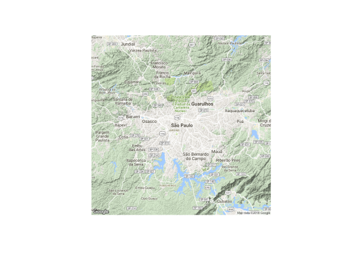
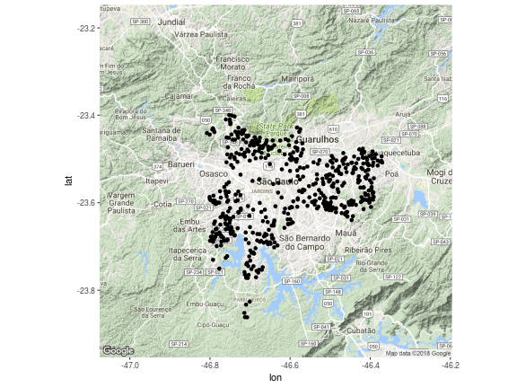

Data frames foram, até este momento do curso, o protagonista de nossa análise de dados. Vimos como manipular dados que estão sempre no mesmo formato

## Informação espacial armazenada em data frames - pontos no google maps

Vamos começar a trabalhar com mapas a partir de um exemplo que, veremos, utilizará as ferramentas que aprendemos até então para produzir nossos primeiros mapas. Para tanto, vamos utilizar o cadastro de escolas que a Prefeitura Municipal de São Paulo disponibiliza [aqui](http://dados.prefeitura.sp.gov.br/).

Nossa primeira tarefa é baixar os dados e faremos isso de forma inteligente e sem "cliques". A partir do url do arquivo do cadastro, que guardaremos no objeto "url\_cadastros\_escolas", faremos o download do arquivo e guardaremos o arquivo .csv baixado como o nome "temp.csv":


```r
url_cadastros_escolas <- "http://dados.prefeitura.sp.gov.br/dataset/8da55b0e-b385-4b54-9296-d0000014ddd5/resource/39db5031-7238-4139-bcaa-e620a3180188/download/escolasr34fev2017.csv"
download.file(url_cadastros_escolas, "temp.csv")
```

Veja que baixar o arquivo diretamente no R é preferível ao processo manual, pois podemos rapidamente reproduzir o processo, além de documentá-lo. Vamos abrir o arquivo:


```r
library(readr)

escolas <- read_delim("temp.csv", delim = ";")
```

Explore o arquivo com o comando _glimpse_:


```r
library(dplyr)

glimpse(escolas)
```

```
## Observations: 5,324
## Variables: 51
## $ DRE         <chr> "G", "FO", "MP", "BT", "PJ", "BT", "FO", "JT", "JT...
## $ CODESC      <chr> "000086", "000094", "000108", "000191", "000205", ...
## $ TIPOESC     <chr> "EMEI", "EMEI", "EMEF", "EMEF", "EMEBS", "EMEI", "...
## $ NOMESC      <chr> "PAULO CAMILHIER FLORENCANO", "VICENTE PAULO DA SI...
## $ DIRETORIA   <chr> "GUAIANASES", "FREGUESIA/BRASILANDIA", "SAO MIGUEL...
## $ SUBPREF     <chr> "GUAIANASES", "CASA VERDE/CACHOEIRINHA", "SAO MIGU...
## $ CEU         <chr> NA, NA, NA, NA, NA, NA, NA, NA, NA, NA, NA, NA, NA...
## $ ENDERECO    <chr> "RUA FELICIANO DE MENDON\xc7A", "RUA DOUTOR FLEURY...
## $ NUMERO      <chr> "502", "295", "159", "140", "206", "90", "51", "34...
## $ BAIRRO      <chr> "JARDIM S\xc3O PAULO(ZONA LESTE)", "VILA SANTA MAR...
## $ CEP         <chr> "08460365", "02563010", "08090290", "05742100", "0...
## $ TEL1        <chr> "25578348", "39813227", "25865294", "58450121", "3...
## $ TEL2        <chr> "25571947", NA, "25811484", NA, "39067229", NA, NA...
## $ FAX         <chr> "25571947", NA, NA, "58450121", NA, "58425113", "3...
## $ SITUACAO    <chr> "Ativa", "Ativa", "Ativa", "Ativa", "Ativa", "Ativ...
## $ CODDIST     <chr> "31", "50", "44", "94", "63", "94", "29", "89", "8...
## $ DISTRITO    <chr> "GUAIANASES", "LIMAO", "JARDIM HELENA", "VILA SONI...
## $ SETOR       <chr> "3103", "5002", "4402", "9404", "6301", "9404", "2...
## $ CODINEP     <int> 35098711, 35098361, 35098760, 35098462, 35079029, ...
## $ CODCIE      <chr> "098711", "098361", "098760", "098462", "079029", ...
## $ EH          <dbl> 1.610781e+14, 1.610702e+14, 1.610771e+14, 1.610792...
## $ DT_CRIACAO  <chr> "13/06/1988", "04/07/1988", "05/07/1988", "27/05/1...
## $ ATO_CRIACAO <chr> "26.134", "26.314", "26.312", "26.003", "26.229", ...
## $ DOM_CRIACAO <chr> "13/06/1988", "04/07/1988", "05/07/1988", "27/05/1...
## $ DT_INI_FUNC <chr> "22/09/1988", "01/08/1988", "01/09/1988", "02/10/1...
## $ DT_AUTORIZA <chr> "16/03/1991", "16/03/1991", "13/03/2001", "16/03/1...
## $ NOME_ANT    <chr> NA, NA, "VILA NITRO OPERARIA", NA, NA, NA, "INSTAL...
## $ T2D3D       <chr> "2D", "2D", "2D", "2D", "2D", "2D", "2D", "2D", "2...
## $ T2D3D15     <chr> "2D", "2D", "2D", "2D", "2D", "2D", "2D", "2D", "2...
## $ T2D3D14     <chr> "2D", "2D", "2D", "2D", "2D", "2D", "2D", "2D", "2...
## $ T2D3D13     <chr> "2D", "2D", "2D", "2D", "2D", "2D", "2D", "2D", "2...
## $ T2D3D12     <chr> "2D", "2D", "2D", "2D", "2D", "2D", "2D", "2D", "2...
## $ T2D3D11     <chr> "2D", "2D", "2D", "2D", "2D", "2D", "2D", "2D", "2...
## $ T2D3D10     <chr> "2D", "2D", "2D", "2D", "2D", "2D", "2D", "2D", "2...
## $ T2D3D09     <chr> "2D", "2D", "2D", "2D", "2D", "2D", "2D", "2D", "3...
## $ T2D3D08     <chr> "3D", "3D", "2D", "2D", "2D", "3D", "2D", "2D", "3...
## $ T2D3D07     <chr> "3D", "3D", "3D", "2D", "2D", "3D", "2D", "3D", "3...
## $ DTURNOS     <chr> "2D", "3D", "3D", "2D", "2D", "3D", "3D", "3D", "3...
## $ DTURNOS15   <chr> "MT", "MT", "MT", "MT", "MT", "MT", "MT", "MT", "M...
## $ DTURNOS14   <chr> "MT", "MT", "MT", "MT", "MT", "MT", "MT", "MT", "M...
## $ DTURNOS13   <chr> "MT", "MT", "MT", "MT", "MT", "MT", "MT", "MT", "M...
## $ DTURNOS12   <chr> "MT", "MT", "MT", "MT", "MTN", "MT", "MT", "MT", "...
## $ DTURNOS11   <chr> "MT", "MT", "MT", "MT", "MTN", "MT", "MT", "MT", "...
## $ DTURNOS10   <chr> "MT", "MT", "MTN", "MT", "MTN", "MT", "MT", "MT", ...
## $ DTURNOS09   <chr> "MT", "MT", "MTN", "MT", "MTN", "MT", "MT", "MT", ...
## $ DTURNOS08   <chr> "MT", "MT", "MTN", "MT", "MTN", "MT", "MT", "MT", ...
## $ DTURNOS07   <chr> "MIV", "MIV", "MTN", "MT", "MTN", "MIV", "MT", "MT...
## $ LATITUDE    <int> -23553905, -23489728, -23478312, -23612237, -23486...
## $ LONGITUDE   <int> -46398452, -46670198, -46427344, -46749888, -46733...
## $ REDE        <chr> "DIR", "DIR", "DIR", "DIR", "DIR", "DIR", "DIR", "...
## $ DATABASE    <chr> "28/02/2017", "28/02/2017", "28/02/2017", "28/02/2...
```

Não há nada de extraordinário no arquivo, que se assemelha aos que vimos até então. Há, porém, uma dupla de variáveis que nos permite trabalhar "geograficamente" com o dado: LATITUDE e LONGITUDE. "Lat e Long" são a informação fundamental de um dos sistemas de coordenadas (_coordinate reference system_, CRS) mais utilizados para localização de objetos na superfície da terra.

Por uma razão desconhecida, a informação fornecida pela PMSP (Prefeitura Municipal de São Paulo) está em formato diferente do convencional. Latitudes são representadas por números entre -90 e 90, com 8 casas decimais, e Longitudes por números entre -180 e 180, também com 8 casas decimais. Em nosso par de variáveis, o separador de decimal está omitido e por esta razão faremos um pequena modificação na variável. Aproveitaremos também para renomear algumas variáveis de nosso interesse -- como tipo da escola (CEI, EMEI, EMEF, CEU, etc) e o ano de início do funcionamento -- e selecionaremos apenas as linhas referentes a EMEF (Escolas Municipal de Ensino Fundamental):


```r
emef <- escolas  %>%
  rename(lat = LATITUDE, lon = LONGITUDE, tipo = TIPOESC) %>% 
  mutate(lat = lat / 1000000, 
         lon = lon / 1000000,
         ano = as.numeric(substr(DT_INI_FUNC, 7, 10))) %>%
  filter(tipo == "EMEF")
```

Pronto! Temos agora uma informação geográfica das EMEFs e uma variável de interesse -- ano -- que utilizaremos para investigar a expansão da rede.

Vamos construir um primeiro mapa, usando a função que conhecemos -- ggplot -- a partir das informações de latitude e longitude das escolas:


```r
library(ggplot2)

ggplot(aes(lon, lat), data = emef) +
  geom_point()
```


Veja que podemos "imaginar" o formato da cidade de São Paulo com os pontos, mas o mapa não é propriamente um mapa. Falta uma "camada" básica, sobre a qual os pontos serão desenhados.

Vamos utilizar o pacote _ggmap_, que é um pacote para visualização de dados espaciais com o pacote _ggplot2_ para obter tal "camada". Com a função _get\_map_, faremos o download de um mapa que servirá de base para os pontos das EMEFs.

A função _get\_map_ requer como argumento principal um par de coordenadas a partir do qual o mapa será centralizado. No nosso exemplo vamos utilizar as coordenadas da Praça da Sé, que serão armazenadas em um vetor. É fácil obter coordenadas de um local a partir de serviços de localização na internet.


```r
library(ggmap)
se <- c(lon = -46.6362714, lat = -23.5500806)
```

Com as coordenadas da Praça de Sé, vamos obter um mapa de São Paulo:


```r
map_sp <- get_map(se)
plot(map_sp)
```



Por padrão, _get\_map_ retorna um mapa de "terreno" e utiliza a API da Google, com zoom e escala automáticos.

Antes de alterar estes argumentos, vamos utilizar uma função "irmã" à _ggplot_, _ggmap_, para juntar o mapa de São Paulo com os pontos das escolas:


```r
ggmap(map_sp) +
  geom_point(aes(lon, lat), data = emef)
```



Feio ainda, porém bastante mais informativo. Veja que combinamos duas fontes de dados: o cadastro da PMSP e um mapa obtido na API da Google.

Vamos obter mapas mais interessantes com _get\_map_. Em primeiro lugar, podemos variar os tipos de mapas (argumento "maptype") e obter qualquer um dentre as seguintes opções: "terrain", "terrain-background", "satellite", "roadmap", "hybrid", "toner", "watercolor", "terrain-labels", "terrain-lines", "toner-2010", "toner-2011", "toner-background", "toner-hybrid", "toner-labels", "toner-lines" e "toner-lite".

Também podemos variar a API -- argumento "source" -- na qual o mapa será obtido: Google ("google"), Open Street Maps ("osm") ou Stamen ("stamen"). Nem todas as "source" e "maptypes" podem ser combinados e os "toner" provêm da API Stamen.

Vejamos alguns exemplos (note o uso do operador "pipe") abaixo:


```r
# Terrain Google
get_map(se, source = "google", maptype = "terrain") %>%
  ggmap() +
  geom_point(aes(lon, lat), data = emef)

# Roadmap Google
get_map(se, source = "google", maptype = "roadmap") %>%
  ggmap() +
  geom_point(aes(lon, lat), data = emef)

# Toner Stamen
get_map(se, source = "stamen", maptype = "toner") %>%
  ggmap() +
  geom_point(aes(lon, lat), data = emef)
```

Vamos alterar o zoom dos mapas e obter apenas mapas e ver o efeito:


```r
get_map(se, source = "google", maptype = "roadmap", zoom = 6) %>%
  ggmap() +
  geom_point(aes(lon, lat), data = emef)

get_map(se, source = "google", maptype = "roadmap", zoom = 10) %>%
  ggmap() +
  geom_point(aes(lon, lat), data = emef)

get_map(se, source = "google", maptype = "roadmap", zoom = 11) %>%
  ggmap() +
  geom_point(aes(lon, lat), data = emef)

get_map(se, source = "google", maptype = "roadmap", zoom = 14) %>%
  ggmap() +
  geom_point(aes(lon, lat), data = emef)

get_map(se, source = "google", maptype = "roadmap", zoom = 18) %>%
  ggmap() +
  geom_point(aes(lon, lat), data = emef)
```

Note que, quando estão fora da base, os pontos são descartados da visualização e obtemos um "warning".

Convém, por conta da gramática da família de funções _ggplot_, definir uma camada básica na função _ggmap_, que, no nosso caso, são os pontos que estão em análise (e não a camada de mapa que (sic) dá base à visualização):


```r
map_sp <- get_map(se, source = "google", maptype = "roadmap", zoom = 11)

ggmap(map_sp, 
      base_layer = ggplot(aes(lon, lat), data = emef)) +
  geom_point()
```

```
## Error in ggplot(aes(lon, lat), data = emef): object 'emef' not found
```

Finalmente, vamos usar uma informação sobre as escolas para diferenciar os pontos. Os dados do cadastro não trazem informações muito interessantes sobre a escola e por isso utilizaremos o ano de criação. Em nosso desafio seguinte trabalharemos com informações sobre a escola que vêm de outra base do mesmo portal da prefeitura.

Introduziremos em nosso mapa uma escala de cores para diferenciar as EMEFs por ano de criação:


```r
map_sp <- get_map(se, source = "google", maptype = "roadmap", zoom = 12)

ggmap(map_sp, 
      base_layer = ggplot(aes(lon, lat, color = ano), data = emef)) +
  geom_point()
```

```
## Error in ggplot(aes(lon, lat, color = ano), data = emef): object 'emef' not found
```

Como era de se esperar, os pontos mais claros na cidade estão nos extremos e as EMEFs mais antigas, e geral, nos bairros que consolidaram mais cedo no processo de urbanização.

## Procurando Lat e Long com o pacote ggmap

E quando temos apenas o endereço dos locais que queremos encontrar? Bem, há alternativas oferecidas pelo próprio pacote _ggmap_.

Vamos agora criar um novo data frame a partir dos dados do cadastro da PMSP que contém apenas os CEUs. Vamos juntar todas as informações de endereço e agregar a elas o texto ", Sao Paulo, Brazil"


```r
ceu <- escolas  %>%
  filter(TIPOESC == "CEU") %>%
  mutate(endereco = paste(ENDERECO, NUMERO, BAIRRO, CEP, ", Sao Paulo, Brazil"))
```

Com a função _geocode_, procuraremos a latitude e longitude dos 46 CEUs. Vamos ver o exemplo do primeiro CEU:


```
## Error in gzfile(file, "rb"): cannot open the connection
```


