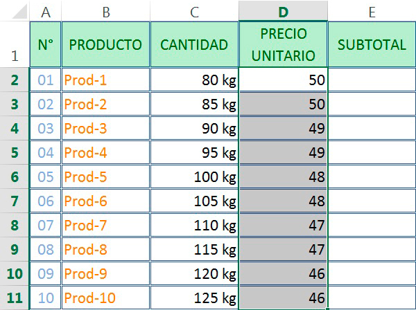

## 1. Introdução

Os dados estão mais próximos de nós do que imaginamos! Podemos consumi-los de diversas formas e uma delas é para nos auxiliar na tomada de decisão ou entendimento sobre algum fenômeno do nosso cotidiano.


Uma das formas mais comuns de analisar esses dados é por meio da __programação__, instruções que o computador recebe para realizar certas tarefas. Estas "instruções" são também chamadas de __algoritmos__, uma sequência de passos lógicos até a realização de determinadas tarefas. Vamos pensar no algoritmo do miojo:

> Passo 1: Tire da embalagem\n Passo 2: Aqueça a água\n Passo 3: Coloque o miojo na água quente\n Passo 4: Adicione o tempero\n Passo 5: Sirva!

Simples, não?

Para que possamos enviar essas instruções para o computador nós precisamos utilizar linguagens que são capazes de ser interpretadas pela máquina e uma delas é o __R__. Mas por que o R?

- O custo de entrada é menor*

- É de graça

- Uma comunidade enorme

Você pode estar se perguntando (ou não) o seguinte: "Como assim o custo de entrada é menor? Não é uma linguagem de programação assim como as outras?". Então, sim, o __R__ é uma linguagem de programação assim como outras que estão por aí, porém, ao longo dos anos as pessoas desenvolveram muitos _pacotes_ voltados para uma análise de dados de forma mais intuitiva. Por exemplo, a fim de selecionar observações (linhas) de interesse, podemos utilizar uma _função_ chamada `filter`, que filtra (seleciona) apenas as linhas desejedas de acordo com as intruções fornecidas. Se isso pareceu confuso, calma! Logo nós iremos utilizá-la junto com outras _funções_ e tudo ficará mais claro.

### O R Básico

Ok, alguns conceitos apareceram, mas não precisamos ficar assustados vamos entende-los. Como queremos utilizar o __R__ para análise de dados, desde o começo iremos nos deparar com duas coisas muito importantes: funções e pacotes. Funções podem ser entendidas como __comandos__. Elas realizam alguma operação. Normalmente, para realizar essa tarefa, elas recebem um _input_ ou parâmetros. Confuso? Vamos com calma, então.

Em primeiro lugar, vamos discutir as estruturas de dados do __R__. Estruturas de dados são formas de guardarmos informações. Existem diferentes tipos dos mais simples aos mais comples. Contudo, tenha em mente apenas duas: vetores e _data frames_. Para entender um vetor, pense em um trem em que cada vagão é um valor. Nesse sentido, se precisarmos guardar a sequência 1, 2, 3, 4 e 5 cada um desses números será um vagão e, como o 1 vem primeiro, você pode entendê-lo como a locomotiva do nosso trem 


Como oporear isso que acamos de aprender no __R__? Basta utilizar o comando `c()`. Por exemplo, `c(1,2,3,4,5)`. Repare que o __c__ é minúsculo e que cada valor é separado por vírgulas. Tome cuidado já que qualquer erro de escrita irá resultar em __erro__. 

Não se esqueça que é possível colocar _strings_ (textos) como valores de um vetor. Para isso, basta utilizar aspas duplas ou simples. Por exemplo, `"Hello World!"` ou `'Hellor World!'`


```r
c(1,2,3,4,5)
```

```
## [1] 1 2 3 4 5
```

```r
c(5,4,3,2,1)
```

```
## [1] 5 4 3 2 1
```

```r
c("Hello World!", "Hello World!²", "Hellor World!³")
```

```
## [1] "Hello World!"   "Hello World!²"  "Hellor World!³"
```

Por sua vez, _data frames_ são muito semelhantes a planilhas de Excel. Eles são compostos por linhas e colunas. A princípio, nas linhas teremos as nossas observações e nas colunas, as variáveis. De modo geral, nós iremos transformar sempre os nossos bancos em _data frames_ por meio de algumas funções. É importante você perceber que um _data frame_ nada mais é do que um conjunto de vetores. Cada vetor, nesse caso, é uma coluna de um _data frame_. 



Como criar um _data frame_?


```r
data.frame(nome = c("Adriana Alos", "José Henrique"),
           nota = c(10, 8.2))
```

```
##            nome nota
## 1  Adriana Alos 10.0
## 2 José Henrique  8.2
```

Após ter uma noção dessas duas estruturas de dados, podemos avançar em outros dois conceitos muito importantes dentro do R: funções e pacotes. As funções, basicamente, realizam comandos. Normalmente elas recebem alguns parêmetros e devolvem alguma coisa para a gente. Imagine, por exemplo, uma função que pega uma sequência de números e nos devolve a média desses valores. No __R__, a função `mean()` faz exatamente isso. Experimente colocar um vetor dentro dela.


```r
mean(c(1,2,3,4,5))
```

```
## [1] 3
```

```r
mean(c(1,2))
```

```
## [1] 1.5
```

Existem outras funções dentro do R para realizar diversas operações. Algumas calculam média, medianas, desvio padrão, etc e outras podem _plotar_ mapas, gráficos, ou até mesmo calcular coeficientes de regressões e outras coisas mais sofisticadas. Quando algúem cria uma função ou um conjunto de funções e quer compartilhar com outras pessoas, ela normalmente irá organizar essas funções dentro de um pacote. No __R__, existe uma infinitude de pacotes disponíveis dentro do __CRAN__. Aliás isso é justamente um dos pontos mais fortes do R, ele possui uma comunidade gigante criando e atualizando esses pacotes. Logo dificilmente você precisa implementar uma função do 0. Em geral, alguém já fez isso para você.

Como instalar pacotes? Utilize a função `install.packages()`


```r
install.packages("tidyverse")
```

O comando acima instala o pacote `tidyverse`. Após, intalá-lo você precisa carregá-lo dentro do R. Para isso, basta utilizar a função `library()`


```r
library(tidyverse)
```

```
## Error in library(tidyverse): there is no package called 'tidyverse'
```

Antes de discutirmos o próximo tópico, vale ressaltar o que é provavelmente a função mais importante do R, o `<-`. Ela salva os nossos dados em objetos. Esses objetos possuem nomes e podem ser __chamados__ facilmente ao longo do nosso _script_.


```r
vetor <- c(1,2,3,4,5)

mean(vetor)
```

```
## [1] 3
```

```r
data <- data.frame(nome = c("Adriana Alos", "José Henrique"),
                   nota = c(10, 8.2))

data
```

```
##            nome nota
## 1  Adriana Alos 10.0
## 2 José Henrique  8.2
```

No _data frame_, para chamar um coluna, você pode utilizar o `$`. Logo para sabbermos a média das notas


```r
mean(data$nota)
```

```
## [1] 9.1
```


### Fluxo de Ciência de Dados


### Organização da Oficina

## 2. Importação de Dados (readr)


```r
library(tidyverse)
```

```
## Error in library(tidyverse): there is no package called 'tidyverse'
```

```r
candidatos <- read_csv("data/CANDIDATOS_DEPUTADO_FEDERAL_2014.csv")
```

```
## Error: 'data/CANDIDATOS_DEPUTADO_FEDERAL_2014.csv' does not exist in current working directory ('/home/travis/build/R4CS/material').
```

## 3. Trasformações dos Dados (dplyr e %>%)

Com objetivo de realizar as nossas transformações, iremos utilizar o pacote `dplyr` do `tidyverse`. A linguagem é bem simples e direta. Por exemplo, `filter` filtra as nossas observações de acordo com valores selecionados; `mutate` (dê um google na tradução) altera ou modifica uma variável do nosso banco; e assim por diante.

Primeiro, vamos ver a qualidade dos nossos dados e realizar as devidas transformações.

Vamos começar com a variável de descrição da candidatura (DES_SITUACAO_CANDIDATURA). Ela diz se aquele candidato teve uma candidatura deferida ou não.

Uma maneira de ver todas as categorias é com a função `count()`. Ela literalmente __conta__ as categorias presentes em uma variável.


```r
candidatos %>%
  count(DES_SITUACAO_CANDIDATURA)
```

```
## Error in eval(lhs, parent, parent): object 'candidatos' not found
```

Repare que existem duas alternativas para candidaturas deferidas: "DEFERIDO" e "DEFERIDO COM RECURSO". A princípio, como o nosso objetivo é trabalhar com os candidatos que de fato concorreram para a câmara federal, vamos filtrar os nossos dados. Iremos selecionar apenas pessoas com candidaturas deferidas. Para isso, existe a função `filter()`. Ela recebe como parâmetro uma condição lógica, ou seja, no nosso caso, uma igualdade entre as valores que queremos dentro de uma variável.


```r
candidatos <- candidatos %>%
  filter(DES_SITUACAO_CANDIDATURA %in% c("DEFERIDO", "DEFERIDO COM RECURSO"))
```

```
## Error in eval(lhs, parent, parent): object 'candidatos' not found
```

O operador `%in%` é uma generalização do `==`. Ele testa a igualdade  de um de mais de um valor ao mesmo tempo.

Após organizar a questão das candidaturas, vamos para o resultado da eleição. A variável `DESC_SIT_TOT_TURNO` diz para nós se o candidato foi eleito ou não e em que modalidade ele foi eleito.


```r
candidatos %>%
  count(DESC_SIT_TOT_TURNO)
```

```
## Error in eval(lhs, parent, parent): object 'candidatos' not found
```

De um lado, temos duas categorias de eleitos: "ELEITO POR MÉDIA" e "ELEITO POR QP". Por outro lado, os não eleitos: "NÃO ELEITO" e "SUPLENTE". Precisamos transformar essa variável para uma coisa mais interessante para a nossa análise, embora ela possa ter significado em outras perguntas de pesquisa.

A fim de realizar esse trablho, iremos utilizar a função `ifelse()`. Para quem conhece a estrutura de `if` `else`, o `case_when` é uma maneira mais simples de trabalhar com mais de uma condição ao mesmo tempo.


```r
candidatos <- candidatos %>%
  mutate(RES_ELEICAO = ifelse(DESC_SIT_TOT_TURNO %in% c("ELEITO POR MÉDIA", "ELEITO POR QP"), "Eleito", "Não Eleito"))
```

```
## Error in eval(lhs, parent, parent): object 'candidatos' not found
```

Por fim, nós propomos uma recodificação da variável de cor/raça. Ao invés de trablhar com as categorias do IBGE, vamos reclassicá-las para algo que tenha mais sentido para cientistas sociais.


```r
candidatos %>%
  count(DESCRICAO_COR_RACA)
```

```
## Error in eval(lhs, parent, parent): object 'candidatos' not found
```


```r
candidatos <- candidatos %>%
  mutate(RACA = case_when(DESCRICAO_COR_RACA == "BRANCA"   ~ "Brancos",
                          DESCRICAO_COR_RACA == "INDÍGENA" ~ "Não Brancos",
                          DESCRICAO_COR_RACA == "PARDA"    ~ "Não Brancos",
                          DESCRICAO_COR_RACA == "PRETA"    ~ "Não Brancos"))
```

```
## Error in eval(lhs, parent, parent): object 'candidatos' not found
```


```r
candidatos %>%
  count(DESCRICAO_SEXO)
```

```
## Error in eval(lhs, parent, parent): object 'candidatos' not found
```


```r
candidatos %>%
  count(DESCRICAO_ESTADO_CIVIL)
```

```
## Error in eval(lhs, parent, parent): object 'candidatos' not found
```


```r
candidatos %>%
  count(DESCRICAO_GRAU_INSTRUCAO)
```

```
## Error in eval(lhs, parent, parent): object 'candidatos' not found
```

Tudo certo? Aparentemente sim!

Que tal olhar algumas curiosidades antes de trabalharmos na visualização dos nossos dados?

Você já se perguntou provavelmente quantas mulheres negras concorrem nas eleições. Avaliar isso com o `dplyr` é bem fácil. Basta chamar o `count` com dois parâmetros.


```r
candidatos %>%
  count(DESCRICAO_SEXO, DESCRICAO_COR_RACA)
```

```
## Error in eval(lhs, parent, parent): object 'candidatos' not found
```

## 4. Visualização dos Dados (ggplot2 e plotly)

Agora, vamos para uma das coisas mais legais dentro da análise de dados. Após levantar uma pergunta relevante/interessante, o próximo passo é explorar os seus dados e ver se eles estão de acordo com as hipóteses levantadas. Embora existam técnicas bem sofisticadas para esse processo (regressões multivariadas, etc), normalmente nós começamos com algumas visualizações. Dentro do R, há um pacote chamado __ggplot2__ criado por Hadley Wickham (um deus do R). Ele é um dos melhores pacotes para criar gráficos dentro do R e relativamente fácil de utilizar.


```r
candidatos %>% 
  ggplot(mapping = aes(x = DESCRICAO_SEXO)) +
  geom_bar()
```

```
## Error in eval(lhs, parent, parent): object 'candidatos' not found
```


```r
candidatos %>% 
  ggplot(mapping = aes(x = RACA)) +
  geom_bar()
```

```
## Error in eval(lhs, parent, parent): object 'candidatos' not found
```

Substitua o valor de `x` dentro de `aes()` por outras variáveis e veja a distribuição.

Uma coisa que me interessa bastante é a diferença de perfis raciais e de gênero entre partidos. Por acaso, existiriam partidos mais brancos e mais masculinos? Existiria o contrário? Partidos com mais mulheres e com mais pessoas não brancas? O que vocês acham?


```r
candidatos %>% 
  group_by(SIGLA_PARTIDO) %>% 
  summarise(PROP_MULHERES    = sum(DESCRICAO_SEXO == "FEMININO")/n(),
            PROP_NAO_BRANCOS = sum(RACA == "Não Brancos", na.rm = T)/n()) %>% 
  ggplot(mapping = aes(x = PROP_NAO_BRANCOS, y = PROP_MULHERES, label = SIGLA_PARTIDO)) +
  geom_label(alpha = 0.6)
```

```
## Error in eval(lhs, parent, parent): object 'candidatos' not found
```

Muito bacana, não? Se você não sabe, a princípio, as listas de candidatos precisam ter 30% de mulheres. Tendo em vista o gráfico acima, por que não observamos esse padrão em todos os partidos? Será que todos estão fora da lei? Se você olhar o site do [planalto](http://www.planalto.gov.br/ccivil_03/leis/l9504.htm), verá que na verdade essa regra serve tanto para partidos quanto para coligações. Provavelmente, os partidos que estão abaixo da linha realizam coligações e conseguem passar as listas pelo TSE. Nós não iremos investigar isso porque os dados do TSE sobre coligações têm qualidade muito baixa e provavelmente iríamos nos deparar com diversas inconsistências. Fique a vontade para explorar isso em casa e pedir nossa ajuda se precisar. 

Bom, vamos voltar para o R! O gráfico acima é meio feio e, como uma parte importante da visualização é a comunicação, seria preciso realizar algumas modificações para ele ficar mais apresentável. Vamos utilizar as seguintes funções para isso `labs`, e `theme_`. Baixe e instale o pacote `ggthemes` também. Ele contém alguns temas bem bonitos para gráficos do __ggplot2__.


```r
install.packages("ggthemes")
```


```r
library(ggthemes)

candidatos %>% 
  group_by(SIGLA_PARTIDO) %>% 
  summarise(PROP_MULHERES    = sum(DESCRICAO_SEXO == "FEMININO")/n(),
            PROP_NAO_BRANCOS = sum(RACA == "Não Brancos", na.rm = T)/n()) %>% 
  ggplot(mapping = aes(x = PROP_NAO_BRANCOS, y = PROP_MULHERES, label = SIGLA_PARTIDO)) +
  geom_label(alpha = 0.6) +
  theme_calc() +
  labs(x = "Proporção de Não Brancos",
       y = "Proporção de Mulheres",
       title = "Perfil dos Candidatos a Deputado Federal",
       caption = "Fonte: TSE")
```

```
## Error in eval(lhs, parent, parent): object 'candidatos' not found
```

Substitua `theme_calc` por outros e veja qual o melhor para você.

## 5. Comunicação (R Markdown)

Tendo em vista o fluxo da ciência de dados, o último passo é comunicar os nossos achados. Isso pode ser feito de diversas maneiras. Contudo, ao utilizar o R, nós temos o `RMarkdown`. Para quem já utilizou `markdown` ou Latex, a ideia é bem parecida. A preocupação será principalmente com o conteúdo e deixaremos a diagramação com os padrões utilizados pelo `RMarkdown` ou por um _template_ previamente escolhido.

## 6. EXTRA Mapas

Que tal explorar os seus dados espacialmente? Para isso, iremos utilizar três pacotes: `sf` (simple features) e o `ggplot2` (versão de desenvolvedor), `mapproj` (para mapas interativos). Execute os comandos abaixo. Fique atento que provavelmente você terá que instalar o pacote de desenvolvedor do __R__ e isso demora um pouco. A fim de facilitar a nossa vida, iremos utilizar o pacote `brmap` para baixarmos os polígonos do Brasil.


```r
install.packages(c("sf", "mapview", "devtools"))
devtools::install_github("tidyverse/ggplot2")
devtools::install_github("italocegatta/brmap")
```

Carregue os pacotes.


```r
library(sf)
library(mapview)
library(ggplot2)
library(brmap)
```

```
## Error in library(brmap): there is no package called 'brmap'
```

Carregue os polígonos de estados e salve em um objeto.


```r
estados <- brmap_estado
```

```
## Error in eval(expr, envir, enclos): object 'brmap_estado' not found
```

Podemos começar _plotando_ o mapa do Brasil, subdidivido em Estados. Normalmente, nós utilizamos o `theme_map` do pacote `ggthemes` para criar mapas. 


```r
estados %>% 
  ggplot() +
  geom_sf() +
  theme_map()
```

```
## Error in eval(lhs, parent, parent): object 'estados' not found
```

Muito bonito, não? Agora precisamos fazer uma pergunta interessante para ser avaliada espacialmente. Que tal avaliar quais estados possuem mais mulheres como candidatas?


```r
candidatos_uf <- candidatos %>% 
  group_by(SIGLA_UF) %>% 
  summarise(PROP_MULHERES = sum(DESCRICAO_SEXO == "FEMININO")/n())
```

```
## Error in eval(lhs, parent, parent): object 'candidatos' not found
```

```r
estados <- estados %>% 
  rename(SIGLA_UF = estado_sigla)
```

```
## Error in eval(lhs, parent, parent): object 'estados' not found
```

```r
estados_gen <- estados %>% 
  left_join(candidatos_uf)
```

```
## Error in eval(lhs, parent, parent): object 'estados' not found
```

```r
estados_gen%>% 
  ggplot(mapping = aes(fill = PROP_MULHERES)) +
  geom_sf(color = "white")
```

```
## Error in eval(lhs, parent, parent): object 'estados_gen' not found
```


```r
estados_gen%>% 
  ggplot(mapping = aes(fill = PROP_MULHERES)) +
  geom_sf(color = "white") +
  coord_sf(datum = NA) + #Remove as linhas
  theme_map() +
  labs(fill = "Proporção",
       title = "Proporção de Mulheres Candidatas por UF",
       caption = "Fonte: TSE")
```

```
## Error in eval(lhs, parent, parent): object 'estados_gen' not found
```

Você pode testar coisas parecidas para outras variáveis ou realmente cair de cabeça na ciência política e explorar uma das diversas hipóteses discutidas por aí sobre dependência espacial do voto. Não iremos seguir esse caminho já que envolveria uma limpeza mais cuidadosa dos dados e outras dificuldades que necessitariam mais paciência.

Por fim, que tal colocar o seu mapa de modo interativo? Um mapa já chama atenção, mas imagine se o seu usuário pudesse dar zoom, clicar e navegar pelo mapa de maneira semelhante a um _google maps_. Para fazer isso no R, é muito fácil! Basta utilizar o `mapproj`.


```r
estados_gen %>% 
  mapview(zcol="PROP_MULHERES",
          map.types = "OpenStreetMap",
          legend = T)
```

```
## Error in eval(lhs, parent, parent): object 'estados_gen' not found
```

Muito legal, não? Eu sinceramente gosto muito de coisas interativas. Confesso que talvez essa visualização em especial não seja muito interessante de ser colocada em um mapa interativo. Porém, imagine se estivessemos trabalhando com municípios ou com todos os países!

Para quem tiver mais interesse, recomendo aprender mais sobre `leaflet`, `plotly` e `shiny`. São dois pacotes básicos para quem gosta de utilizar gráficos e interativos.


