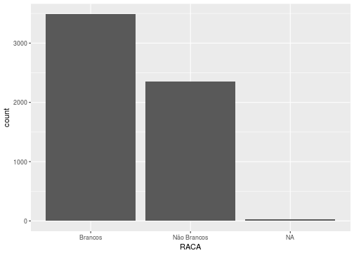
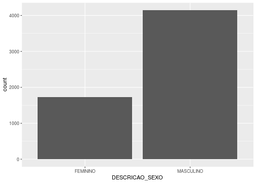
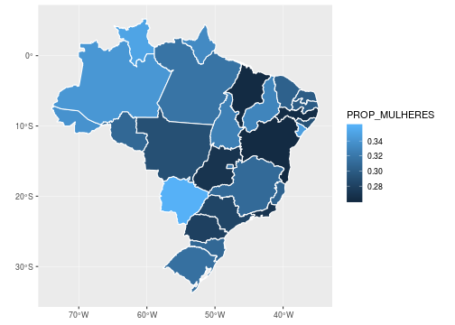
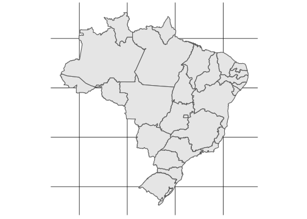

## 1. Introdução

Os dados estão mais próximos de nós do que imaginamos! Podemos consumi-los de diversas formas e uma delas é para nos auxiliar na tomada de decisão ou entendimento sobre algum fenômeno do nosso cotidiano.


Uma das formas mais comuns de analisar esses dados é por meio da __programação__, instruções que o computador recebe para realizar certas tarefas. Estas "instruções" são também chamadas de __algoritmos__, uma sequência de passos lógicos até a realização de determinadas tarefas. Vamos pensar no algoritmo do miojo:

> Passo 1: Tire da embalagem

> Passo 2: Aqueça a água 

> Passo 3: Coloque o miojo na água quente

> Passo 4: Adicione o tempero


> Passo 5: Sirva!

Simples, não?

Para que possamos enviar essas instruções para o computador nós precisamos utilizar linguagens que são capazes de ser interpretadas pela máquina e uma delas é o __R__. Mas por que o R?

- O custo de entrada é menor*

- É de graça

- Tem uma comunidade enorme

Você pode estar se perguntando (ou não) o seguinte: "Como assim o custo de entrada é menor? Não é uma linguagem de programação assim como as outras?". Então, sim, o __R__ é uma linguagem de programação assim como outras que estão por aí, porém, ao longo dos anos as pessoas desenvolveram muitos _pacotes_ voltados para uma análise de dados de forma mais intuitiva. Por exemplo, a fim de selecionar observações (linhas) de interesse, podemos utilizar uma _função_ chamada `filter`, que filtra (seleciona) apenas as linhas desejedas de acordo com as intruções fornecidas. Se isso pareceu confuso, calma! Logo nós iremos utilizá-la junto com outras _funções_ e tudo ficará mais claro.

### O R Básico

Ok, alguns conceitos apareceram, mas não precisamos ficar assustados. Iremos entende-los com o tempo e com a prática. Para começar a nossa jornada dentro do __R__, vamos nos dedicar a entender as estruturas de dados mais utilizdas dentro dele. Estruturas de dados são maneiras de se guardar informações. No R, embora existam outras, temos duas estruturas de dados muito importantes: os vetores e os _data frames_.

Um vetor nada mais é do que uma sequência de valores. Podemos imaginá-lo como um trem, em que cada vagão corresponde a um valor. Nesse sentido, se quisermos guardar a sequência 1, 2, 3, 4 e 5, o 1 seria nossa locomotiva, seguida de quatro vagões.


Para criar um vetor no __R__, basta utilizar o comando `c()`. Por exemplo, `c(1,2,3,4,5)`. Repare que o __c__ é minúsculo e que cada valor é separado por vírgulas. Tome cuidado já que qualquer erro de escrita irá resultar em __erro__. 

Não se esqueça que é possível colocar _strings_ (textos) como valores de um vetor. Para isso, basta utilizar aspas duplas ("") ou simples (''). Por exemplo, `"Hello World!"` ou `'Hellor World!'`


```r
c(1,2,3,4,5)
```

```
## [1] 1 2 3 4 5
```

```r
c(5,4,3,2,1)
```

```
## [1] 5 4 3 2 1
```

```r
c("Hello World!", "Hello World!²", "Hellor World!³")
```

```
## [1] "Hello World!"   "Hello World!²"  "Hellor World!³"
```

Por sua vez, _data frames_ são muito semelhantes a planilhas de Excel. Eles são compostos por linhas e colunas. A princípio, nas linhas teremos as nossas observações e nas colunas, as variáveis. De modo geral, nós iremos transformar sempre os nossos bancos em _data frames_ por meio de algumas funções. É importante você perceber que um _data frame_ nada mais é do que um conjunto de vetores. Cada vetor, nesse caso, é uma coluna de um _data frame_. 


Como criar um _data frame_? Basta utilizar a função `data.frame`, que recebe como parâmetro vetores. Vamos tentar reproduzir o _data frame_ acima no R?


```r
data.frame(PRODUCTO        = c("Prod-1", "Prod-2", "Prod-3", "Prod-4", "Prod-5", "Prod-6", "Prod-7", "Prod-8", "Prod-9", "Prod-10"),
           CANTIDAD        = c("80 kg", "85 kg", "90 kg", "95 kg", "100 kg", "105 kg", "110 kg", "115 kg", "120 kg", "125 kg"),
           PRECIO_UNITARIO = c(50, 50, 49, 49, 48, 48, 47,47, 46, 46))
```

```
##    PRODUCTO CANTIDAD PRECIO_UNITARIO
## 1    Prod-1    80 kg              50
## 2    Prod-2    85 kg              50
## 3    Prod-3    90 kg              49
## 4    Prod-4    95 kg              49
## 5    Prod-5   100 kg              48
## 6    Prod-6   105 kg              48
## 7    Prod-7   110 kg              47
## 8    Prod-8   115 kg              47
## 9    Prod-9   120 kg              46
## 10  Prod-10   125 kg              46
```

Fique tranquilo que dificilmente nós importamos dados na mão para o R. De modo geral, ou iremos raspar os dados da internet (APIs e webscraping) ou iremos importar o nosso banco de um formato muito conhecido, o __.csv__.

Após ter uma noção dessas duas estruturas de dados, podemos avançar em outros dois conceitos muito importantes dentro do R: funções e pacotes. De certo modo, nós já vimos algumas funções. Tanto o `data.frame()` quanto o `c()` são funções, isto é, elas executam algum comando. Podemos ler funções como __ações__. Com isso, a função `c()` pode ser lida como _crie um vetor a partir dos seguintes valores_. "Seguintes valores" são para nós os parâmetros dessa função, os _inputs_ ou entradas necessárias para que uma função seja capaz de executar um comando. Resumindo, funções realizam __ações__ de acordo __parâmetros__. 

Vamos para um outro exemplo. Dentre as diversas funções disponíveis no __R__, existe uma chamada `mean()`. Como o nome diz, ela calcula a média. Mas qual ou quais parâmetros ela recebe? Para descubrir isso, você pode utilizar o comando `?mean` no seu console. Vemos que ela recebe um parâmetro `x` que nada mais é do que um __vetor__ contento valores númericos. Sabendo disso, que tal calcularmos uma média bem simples? Qual a média entre 1 e 2? E qual a média entre 1, 2, 3, 4 e 5?


```r
mean(c(1,2))
```

```
## [1] 1.5
```

```r
mean(c(1,2,3,4,5))
```

```
## [1] 3
```

Fácil, não? Porém, até agora, nós estamos trabalhando com o __R__ de maneira muito ineficiente. Toda vez que realizamos uma operação precisamos escrever os valores na mão. Para evitar repitções, nós normalmente salvamos nossos objetos em nomes. Para isso, utilizamos a função `<-` (no RStudio, o atalho é Alt + -). `<-` é uma função, mas ela opera de maneira diferente. Não é necessário utilizar parênteses ao utilizá-la. Do lado esquerdo colocamos o nome do nosso objeto e, do lado direito, o objeto em si. Por exemplo,


```r
vetor1 <- c(1,2)

vetor2 <- c(1,2,3,4,5)

dataframe1 <- data.frame(PRODUCTO        = c("Prod-1", "Prod-2", "Prod-3", "Prod-4", "Prod-5", "Prod-6", "Prod-7", "Prod-8", "Prod-9", "Prod-10"),
                         CANTIDAD        = c("80 kg", "85 kg", "90 kg", "95 kg", "100 kg", "105 kg", "110 kg", "115 kg", "120 kg", "125 kg"),
                         PRECIO_UNITARIO = c(50, 50, 49, 49, 48, 48, 47,47, 46, 46))
```

Pronto nós salvamos os nossos objetos em nomes. Dessa maneira, podemos chamá-los em outras operações.


```r
mean(vetor1)
```

```
## [1] 1.5
```

```r
mean(vetor2)
```

```
## [1] 3
```

```r
mean(dataframe1$PRECIO_UNITARIO)
```

```
## [1] 48
```

Você entendeu esse comando `dataframe1$PRECIO_UNITARIO`? Caso tenha ficado confuso, lembre-se que um _data frame_ é um conjunto de vetores, que formam as colunas. Sabendo disso, fica mais fácil entender que o código `dataframe1$PRECIO_UNITARIO` chamou a coluna `PRECIO_UNITARIO` do _data frame_ `dataframe1`, criado por nós anteriormente.

Existem outras funções dentro do R para realizar diversas operações. De um lado, podemos fazer coisas simples como calcular a média, a mediana, o desvio padrão. De outro, é possível _plotar_ mapas, gráficos, além de criar aplicativos. Em geral, a maior parte dessas coisas já está implementada no __R__ e você não precisa criar uma função para, por exemplo, calcular o coeficiente de regressão linear. Porém, quando algúem cria uma função ou um conjunto de funções e quer compartilhar com outras pessoas, ela normalmente irá organizar essas funções dentro de um pacote. No __R__, existe uma infinitude de pacotes disponíveis dentro do __CRAN__ e, para instalá-los, basta um comando `install.packages()`, que recebe o nome do pacote como parâmetro.


```r
install.packages("tidyverse")
```

O comando acima instala o pacote `tidyverse`. Após, intalá-lo você precisa carregá-lo dentro do R. Para isso, basta utilizar a função `library()`


```r
library(tidyverse)
```

### Fluxo de Ciência de Dados


Durante nossa análise, em geral trabalhamos com um fluxo de ciências de dados criado por _Hadley Wickham_. Em primeiro lugar, importamos um banco de dados para o __R__. Em seguida, ajustamos a sua estrutura de acordo com um padrão _tidy_, isto é, garantimos que as colunas sejam apenas variáveis e que as linhas sejam objservações. No passo seguinte, nós procuramos responder a nossa pergunta. A caixa _understand_ é o momento em que respondemos a nossa pergunta. Por fim, na última fase, temos a comunicação. Responder uma pergunta para nós mesmos pode ser interessante, mas normalmente queremos comunicar os achados para outras pessoas.

### Organização da Oficina

## 2. Importação de Dados (readr)

O primeiro passo para uma análise é a __importação__.


```r
library(tidyverse)

candidatos <- read_csv("data/CANDIDATOS_DEPUTADO_FEDERAL_2014.csv")
```

## 3. Trasformações dos Dados (dplyr e %>%)

Com objetivo de realizar as nossas transformações, iremos utilizar o pacote `dplyr` do `tidyverse`. A linguagem é bem simples e direta. Por exemplo, `filter` filtra as nossas observações de acordo com valores selecionados; `mutate` (dê um google na tradução) altera ou modifica uma variável do nosso banco; e assim por diante. Uma das funções presentes no `tidyverse` é o `%>%` (leia-se _pipe_). Ela é muito importante já que nos permite concatenar funções e, assim, realizar operações de maneira mais eficiente. Você pode ler o _pipe_ como "depois". Nos próximos exemplos, iremos incluir uma leitura recomenda da função.

Feita essa apresentação, vamos começar com algumas operações básicas e limpesa do nosso banco.

Vamos começar com a variável de descrição da candidatura (DES_SITUACAO_CANDIDATURA). Ela diz se aquele candidato teve uma candidatura deferida ou não.

Uma maneira de ver todas as categorias é com a função `count()`. Ela literalmente __conta__ as categorias presentes em uma variável.


```r
candidatos %>%
  count(DES_SITUACAO_CANDIDATURA)
```

```
## # A tibble: 8 x 2
##   DES_SITUACAO_CANDIDATURA       n
##   <chr>                      <int>
## 1 CANCELADO                     14
## 2 DEFERIDO                    5861
## 3 DEFERIDO COM RECURSO           8
## 4 FALECIDO                       3
## 5 INDEFERIDO                   806
## 6 INDEFERIDO COM RECURSO         6
## 7 NÃO CONHECIMENTO DO PEDIDO    12
## 8 RENÚNCIA                     328
```

Repare que existem duas alternativas para candidaturas deferidas: "DEFERIDO" e "DEFERIDO COM RECURSO". A princípio, como o nosso objetivo é trabalhar com os candidatos que de fato concorreram para a câmara federal, vamos filtrar os nossos dados. Iremos selecionar apenas pessoas com candidaturas deferidas. Para isso, existe a função `filter()`. Ela recebe como parâmetro uma condição lógica, ou seja, no nosso caso, uma igualdade entre as valores que queremos dentro de uma variável.


```r
candidatos <- candidatos %>%
  filter(DES_SITUACAO_CANDIDATURA %in% c("DEFERIDO", "DEFERIDO COM RECURSO"))
```

O operador `%in%` é uma generalização do `==`. Ele testa a igualdade  de um de mais de um valor ao mesmo tempo.

Após organizar a questão das candidaturas, vamos para o resultado da eleição. A variável `DESC_SIT_TOT_TURNO` diz para nós se o candidato foi eleito ou não e em que modalidade ele foi eleito.


```r
candidatos %>%
  count(DESC_SIT_TOT_TURNO)
```

```
## # A tibble: 4 x 2
##   DESC_SIT_TOT_TURNO     n
##   <chr>              <int>
## 1 ELEITO POR MÉDIA      73
## 2 ELEITO POR QP        440
## 3 NÃO ELEITO          1336
## 4 SUPLENTE            4020
```

De um lado, temos duas categorias de eleitos: "ELEITO POR MÉDIA" e "ELEITO POR QP". Por outro lado, os não eleitos: "NÃO ELEITO" e "SUPLENTE". Precisamos transformar essa variável para uma coisa mais interessante para a nossa análise, embora ela possa ter significado em outras perguntas de pesquisa.

A fim de realizar esse trablho, iremos utilizar a função `ifelse()`. Para quem conhece a estrutura de `if` `else`, o `case_when` é uma maneira mais simples de trabalhar com mais de uma condição ao mesmo tempo.


```r
candidatos <- candidatos %>%
  mutate(RES_ELEICAO = ifelse(DESC_SIT_TOT_TURNO %in% c("ELEITO POR MÉDIA", "ELEITO POR QP"), "Eleito", "Não Eleito"))
```

Por fim, nós propomos uma recodificação da variável de cor/raça. Ao invés de trablhar com as categorias do IBGE, vamos reclassicá-las para algo que tenha mais sentido para cientistas sociais.


```r
candidatos %>%
  count(DESCRICAO_COR_RACA)
```

```
## # A tibble: 5 x 2
##   DESCRICAO_COR_RACA     n
##   <chr>              <int>
## 1 AMARELA               32
## 2 BRANCA              3488
## 3 INDÍGENA              19
## 4 PARDA               1769
## 5 PRETA                561
```


```r
candidatos <- candidatos %>%
  mutate(RACA = case_when(DESCRICAO_COR_RACA == "BRANCA"   ~ "Brancos",
                          DESCRICAO_COR_RACA == "INDÍGENA" ~ "Não Brancos",
                          DESCRICAO_COR_RACA == "PARDA"    ~ "Não Brancos",
                          DESCRICAO_COR_RACA == "PRETA"    ~ "Não Brancos"))
```


```r
candidatos %>%
  count(DESCRICAO_SEXO)
```

```
## # A tibble: 2 x 2
##   DESCRICAO_SEXO     n
##   <chr>          <int>
## 1 FEMININO        1723
## 2 MASCULINO       4146
```


```r
candidatos %>%
  count(DESCRICAO_ESTADO_CIVIL)
```

```
## # A tibble: 5 x 2
##   DESCRICAO_ESTADO_CIVIL        n
##   <chr>                     <int>
## 1 CASADO(A)                  3298
## 2 DIVORCIADO(A)               654
## 3 SEPARADO(A) JUDICIALMENTE   123
## 4 SOLTEIRO(A)                1674
## 5 VIÚVO(A)                    120
```


```r
candidatos %>%
  count(DESCRICAO_GRAU_INSTRUCAO)
```

```
## # A tibble: 7 x 2
##   DESCRICAO_GRAU_INSTRUCAO          n
##   <chr>                         <int>
## 1 ENSINO FUNDAMENTAL COMPLETO     327
## 2 ENSINO FUNDAMENTAL INCOMPLETO   154
## 3 ENSINO MÉDIO COMPLETO          1535
## 4 ENSINO MÉDIO INCOMPLETO         151
## 5 LÊ E ESCREVE                     51
## 6 SUPERIOR COMPLETO              3003
## 7 SUPERIOR INCOMPLETO             648
```

Tudo certo? Aparentemente sim!

Que tal olhar algumas curiosidades antes de trabalharmos na visualização dos nossos dados?

Você já se perguntou provavelmente quantas mulheres negras concorrem nas eleições. Avaliar isso com o `dplyr` é bem fácil. Basta chamar o `count` com dois parâmetros.


```r
candidatos %>%
  count(DESCRICAO_SEXO, DESCRICAO_COR_RACA)
```

```
## # A tibble: 10 x 3
##    DESCRICAO_SEXO DESCRICAO_COR_RACA     n
##    <chr>          <chr>              <int>
##  1 FEMININO       AMARELA               11
##  2 FEMININO       BRANCA               961
##  3 FEMININO       INDÍGENA               9
##  4 FEMININO       PARDA                539
##  5 FEMININO       PRETA                203
##  6 MASCULINO      AMARELA               21
##  7 MASCULINO      BRANCA              2527
##  8 MASCULINO      INDÍGENA              10
##  9 MASCULINO      PARDA               1230
## 10 MASCULINO      PRETA                358
```

## 4. Visualização dos Dados (ggplot2 e plotly)

Agora, vamos para uma das coisas mais legais dentro da análise de dados. Após levantar uma pergunta relevante/interessante, o próximo passo é explorar os seus dados e ver se eles estão de acordo com as hipóteses levantadas. Embora existam técnicas bem sofisticadas para esse processo (regressões multivariadas, etc), normalmente nós começamos com algumas visualizações. Dentro do R, há um pacote chamado __ggplot2__ criado por Hadley Wickham (um deus do R). Ele é um dos melhores pacotes para criar gráficos dentro do R e relativamente fácil de utilizar.


```r
candidatos %>% 
  ggplot(mapping = aes(x = DESCRICAO_SEXO)) +
  geom_bar()
```


```r
candidatos %>% 
  ggplot(mapping = aes(x = RACA)) +
  geom_bar()
```



Substitua o valor de `x` dentro de `aes()` por outras variáveis e veja a distribuição.

Uma coisa que me interessa bastante é a diferença de perfis raciais e de gênero entre partidos. Por acaso, existiriam partidos mais brancos e mais masculinos? Existiria o contrário? Partidos com mais mulheres e com mais pessoas não brancas? O que vocês acham?


```r
candidatos %>% 
  group_by(SIGLA_PARTIDO) %>% 
  summarise(PROP_MULHERES    = sum(DESCRICAO_SEXO == "FEMININO")/n(),
            PROP_NAO_BRANCOS = sum(RACA == "Não Brancos", na.rm = T)/n()) %>% 
  ggplot(mapping = aes(x = PROP_NAO_BRANCOS, y = PROP_MULHERES, label = SIGLA_PARTIDO)) +
  geom_label(alpha = 0.6)
```



Muito bacana, não? Se você não sabe, a princípio, as listas de candidatos precisam ter 30% de mulheres. Tendo em vista o gráfico acima, por que não observamos esse padrão em todos os partidos? Será que todos estão fora da lei? Se você olhar o site do [planalto](http://www.planalto.gov.br/ccivil_03/leis/l9504.htm), verá que na verdade essa regra serve tanto para partidos quanto para coligações. Provavelmente, os partidos que estão abaixo da linha realizam coligações e conseguem passar as listas pelo TSE. Nós não iremos investigar isso porque os dados do TSE sobre coligações têm qualidade muito baixa e provavelmente iríamos nos deparar com diversas inconsistências. Fique a vontade para explorar isso em casa e pedir nossa ajuda se precisar. 

Bom, vamos voltar para o R! O gráfico acima é meio feio e, como uma parte importante da visualização é a comunicação, seria preciso realizar algumas modificações para ele ficar mais apresentável. Vamos utilizar as seguintes funções para isso `labs`, e `theme_`. Baixe e instale o pacote `ggthemes` também. Ele contém alguns temas bem bonitos para gráficos do __ggplot2__.


```r
install.packages("ggthemes")
```


```r
library(ggthemes)

candidatos %>% 
  group_by(SIGLA_PARTIDO) %>% 
  summarise(PROP_MULHERES    = sum(DESCRICAO_SEXO == "FEMININO")/n(),
            PROP_NAO_BRANCOS = sum(RACA == "Não Brancos", na.rm = T)/n()) %>% 
  ggplot(mapping = aes(x = PROP_NAO_BRANCOS, y = PROP_MULHERES, label = SIGLA_PARTIDO)) +
  geom_label(alpha = 0.6) +
  theme_calc() +
  labs(x = "Proporção de Não Brancos",
       y = "Proporção de Mulheres",
       title = "Perfil dos Candidatos a Deputado Federal",
       caption = "Fonte: TSE")
```


Substitua `theme_calc` por outros e veja qual o melhor para você.

## 5. Comunicação (R Markdown)

Tendo em vista o fluxo da ciência de dados, o último passo é comunicar os nossos achados. Isso pode ser feito de diversas maneiras. Contudo, ao utilizar o R, nós temos o `RMarkdown`. Para quem já utilizou `markdown` ou Latex, a ideia é bem parecida. A preocupação será principalmente com o conteúdo e deixaremos a diagramação com os padrões utilizados pelo `RMarkdown` ou por um _template_ previamente escolhido.

## 6. EXTRA Mapas

Que tal explorar os seus dados espacialmente? Para isso, iremos utilizar três pacotes: `sf` (simple features) e o `ggplot2` (versão de desenvolvedor), `mapproj` (para mapas interativos). Execute os comandos abaixo. Fique atento que provavelmente você terá que instalar o pacote de desenvolvedor do __R__ e isso demora um pouco. A fim de facilitar a nossa vida, iremos utilizar o pacote `brmap` para baixarmos os polígonos do Brasil.


```r
install.packages(c("sf", "mapview", "devtools"))
devtools::install_github("tidyverse/ggplot2")
devtools::install_github("italocegatta/brmap")
```

Carregue os pacotes.


```r
library(sf)
library(mapview)
library(ggplot2)
library(brmap)
```

Carregue os polígonos de estados e salve em um objeto.


```r
estados <- brmap_estado
```

Podemos começar _plotando_ o mapa do Brasil, subdidivido em Estados. Normalmente, nós utilizamos o `theme_map` do pacote `ggthemes` para criar mapas. 


```r
estados %>% 
  ggplot() +
  geom_sf() +
  theme_map()
```


Muito bonito, não? Agora precisamos fazer uma pergunta interessante para ser avaliada espacialmente. Que tal avaliar quais estados possuem mais mulheres como candidatas?


```r
candidatos_uf <- candidatos %>% 
  group_by(SIGLA_UF) %>% 
  summarise(PROP_MULHERES = sum(DESCRICAO_SEXO == "FEMININO")/n())

estados <- estados %>% 
  rename(SIGLA_UF = estado_sigla)

estados_gen <- estados %>% 
  left_join(candidatos_uf)

estados_gen%>% 
  ggplot(mapping = aes(fill = PROP_MULHERES)) +
  geom_sf(color = "white")
```




```r
estados_gen%>% 
  ggplot(mapping = aes(fill = PROP_MULHERES)) +
  geom_sf(color = "white") +
  coord_sf(datum = NA) + #Remove as linhas
  theme_map() +
  labs(fill    = "Proporção",
       title   = "Proporção de Mulheres Candidatas por UF",
       caption = "Fonte: TSE")
```


Você pode testar coisas parecidas para outras variáveis ou realmente cair de cabeça na ciência política e explorar uma das diversas hipóteses discutidas por aí sobre dependência espacial do voto. Não iremos seguir esse caminho já que envolveria uma limpeza mais cuidadosa dos dados e outras dificuldades que necessitariam mais paciência.

Por fim, que tal colocar o seu mapa de modo interativo? Um mapa já chama atenção, mas imagine se o seu usuário pudesse dar zoom, clicar e navegar pelo mapa de maneira semelhante a um _google maps_. Para fazer isso no R, é muito fácil! Basta utilizar o `mapproj`.


```r
estados_gen %>% 
  mapview(zcol      = "PROP_MULHERES",
          map.types = "OpenStreetMap",
          legend    = T)
```



Muito legal, não? Eu sinceramente gosto muito de coisas interativas. Confesso que talvez essa visualização em especial não seja muito interessante de ser colocada em um mapa interativo. Porém, imagine se estivessemos trabalhando com municípios ou com todos os países!

Para quem tiver mais interesse, recomendo aprender mais sobre `leaflet`, `plotly` e `shiny`. São dois pacotes básicos para quem gosta de utilizar gráficos e interativos.


